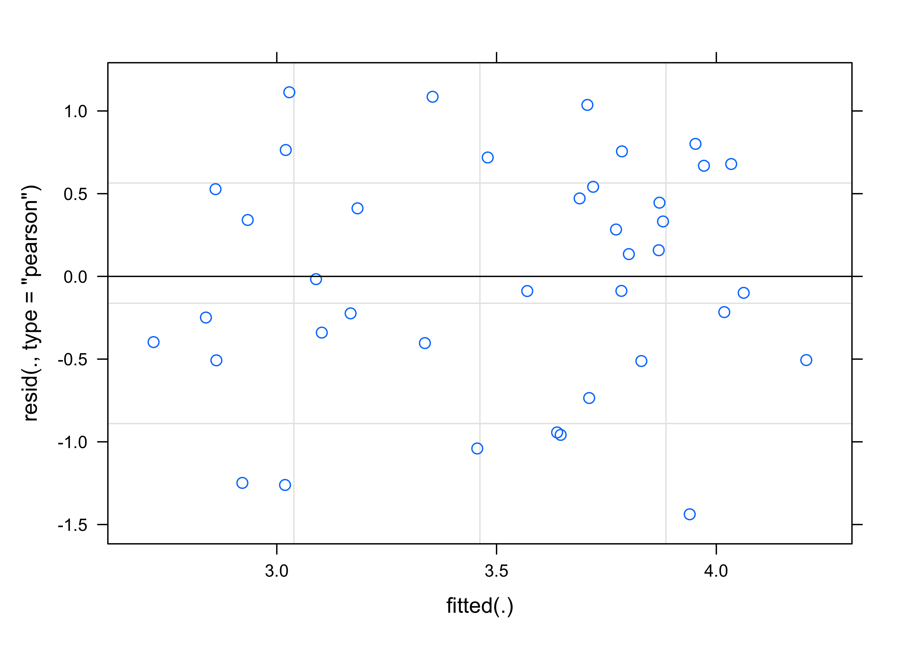

<sup>1</sup> Laboratorio de Ecofisiología y Ecología Evolutiva Marina
(e°CO2lab), Facultad de Ciencias del mar y de Recursos Naturales,
Universidad de Valparaíso, Viña del Mar, Chile.

<sup>2</sup> Centro de Observación Marino para Estudios de Riesgos del
Ambiente Costero (COSTA-R), Universidad de Valparaíso, Chile

<sup>3</sup> Laboratorio de Ictiología e Interacciones Biofíscas
(LABITI), Facultad de Ciencias, Universidad de Valparaíso, Valparaiso,
Chile

<sup>4</sup> Estación Costera de Investigaciones Marinas (ECIM),
Pontificia Universidad Católica de Chile, Las Cruces, Chile.

<sup>5</sup> Center for Applied Ecology and Sustainability (CAPES), and
Instituto Milenio en Socioecología Costera, SECOS, Pontificia
Universidad Católica de Chile, Santiago, Chile.

<sup>6</sup> Center for Oceanographic Research COPAS Coastal,
Universidad de Concepción, Chile

This document reproduces and supports all data work and statistical
analysis of the larval survival, geometric morphometrics and swimming
activity in the paper **"Assessing the effect of acute temperature
changes on the swimming performance, survival and morphometrics of zoea
larvae of the kelp crab *Taliepus dentatus*"**.


# Libraries


``` r
#Mortality libraries
library(cowplot)
library(scales)
library(dplyr)
library(gridExtra)
library(tidyverse) 
library(ggsci)
library(Rmisc)
library(survminer)
library(survival)
library(MASS)

#Morphometrics Libraries 
library(Morpho)
library(geomorph)
library(shapes)
library(StereoMorph)
library(readr)
library(ggplot2)
library(writexl)

#Swimming libraries
library(lme4)
library(plyr)
library(lmerTest)
library(lme4)
library(car)
library(sjPlot)
library(effects)
library(cowplot)
library(emmeans)
library(sjPlot)
library(multcomp)
library(rlist)

cbPalette <- c("#3B4992FF","#008B45FF","#EE0000FF")
```

# Timeseries of environmental temperature


``` r
montemar<-read.table("/Users/lucasb/Library/CloudStorage/GoogleDrive-lucasbravog98@gmail.com/Unidades compartidas/Bravo-Guzman et al/Austral ecology/data/timeseries/miniDOT.dat", header = FALSE)

#MAKING DATETIME COLUMN and ADDING COLUMNS GROUPS
montemar_date <- montemar %>%
  unite("date", V1:V3, sep = "-")
montemar_date$date<-anytime::anydate(montemar_date$date)

montemar_date$jd <- yday(montemar_date$date)  
montemar_date$day<-day(montemar_date$date)
montemar_date$month<-month(montemar_date$date)
montemar_date$year<-year(montemar_date$date)

#mean temperature by days
Day_temp<-montemar_date %>%        
  group_by(year,month, day) %>%   
  dplyr::summarize(mean_temp = mean(V6), SD=sd(V6), min_temp=min(V6), max_temp=max(V6))  
Day_temp<-Day_temp %>% mutate(Date = make_date(year, month, day))
Day_temp<-Day_temp[1:365,] #RUN TO TAKE ONLY FIRST YEAR (2021 JAN-2022 JAN)
Day_temp$month<-as.factor(Day_temp$month)

#mean temperature by month
Month_temp <- montemar_date %>% 
  group_by(year,month) %>%  
  dplyr::summarize(mean_temp = mean(V6, na.rm=T), SD=sd(V6,na.rm=T), n=n())

Month_temp
```

```
## # A tibble: 22 × 5
## # Groups:   year [2]
##     year month mean_temp    SD     n
##    <dbl> <dbl>     <dbl> <dbl> <int>
##  1  2021     1      15.4 1.07   1342
##  2  2021     2      14.5 1.07   4032
##  3  2021     3      14.6 0.953  4464
##  4  2021     4      13.9 0.611  4320
##  5  2021     5      14.1 0.888  4464
##  6  2021     6      12.6 0.521  4320
##  7  2021     7      12.2 0.159  4464
##  8  2021     8      12.5 0.198  4464
##  9  2021     9      12.5 0.410  4320
## 10  2021    10      12.2 0.644  4464
## # ℹ 12 more rows
```

``` r
ggplot(Day_temp, aes(x=Date, y=mean_temp,ymin=Day_temp$min_temp, ymax=Day_temp$max_temp))+ geom_ribbon(fill = "black", alpha = 0.4) + geom_line(color="black")+ theme_bw() + scale_x_date(date_labels = "%b", date_breaks = "1 month") +
  labs(y="Temperature (C°)")+ theme(plot.margin = margin(0.2,0.5,0.2,0.2, "cm")) + labs(x=element_blank()) 
```

<!-- -->

``` r
#ggsave("/Users/lucasb/Library/CloudStorage/GoogleDrive-lucasbravog98@gmail.com/Unidades compartidas/Bravo-Guzman et al/Austral ecology/Resultados/timeseries.pdf", dpi=600)
```

# Mortality

## 1. Import of data base and definition of factors


``` r
#data are available in the online version of the article, write your own filepath
Mort<-read.delim("/Users/lucasb/Library/CloudStorage/GoogleDrive-lucasbravog98@gmail.com/Unidades compartidas/Bravo-Guzman et al/Austral ecology/data/mortality/mort 2.txt")
Mort$bino<-Mort$alive/100

#Temperature as factor
Mort$Temperature<-as.factor(Mort$Temperature)
```

## 2. Data summary


``` r
# SD, SE, CI and  MEAN
LT50_summary<- summarySE(Mort, measurevar="bino",
                         groupvars=c("Temperature","Day"))
head(LT50_summary)
```

```
##   Temperature Day N      bino          sd          se         ci
## 1          12   1 3 1.0000000 0.000000000 0.000000000 0.00000000
## 2          12   2 3 0.9766667 0.005773503 0.003333333 0.01434218
## 3          12   3 3 0.5000000 0.115325626 0.066583281 0.28648474
## 4          12   4 3 0.3066667 0.210792157 0.121700908 0.52363675
## 5          12   5 3 0.2966667 0.202319879 0.116809436 0.50259044
## 6          12   6 3 0.2966667 0.202319879 0.116809436 0.50259044
```

## 3. Generalized Lineal Model (GLM) analysis and LT50%


``` r
#separation of the table by temp 
mort_12<-LT50_summary[1:11, ]
mort_15<-LT50_summary[12:22, ]
mort_17<-LT50_summary[23:32,]

#GLM analysis for 12°C
model1<-glm(data=mort_12, bino ~ Day, family=quasibinomial())
summary(model1)
```

```
## 
## Call:
## glm(formula = bino ~ Day, family = quasibinomial(), data = mort_12)
## 
## Deviance Residuals: 
##     Min       1Q   Median       3Q      Max  
## -0.5179  -0.2999  -0.0738   0.3400   0.5964  
## 
## Coefficients:
##             Estimate Std. Error t value Pr(>|t|)   
## (Intercept)   2.1710     0.6380   3.403  0.00784 **
## Day          -0.4791     0.1117  -4.289  0.00202 **
## ---
## Signif. codes:  0 '***' 0.001 '**' 0.01 '*' 0.05 '.' 0.1 ' ' 1
## 
## (Dispersion parameter for quasibinomial family taken to be 0.1436587)
## 
##     Null deviance: 5.4993  on 10  degrees of freedom
## Residual deviance: 1.5399  on  9  degrees of freedom
## AIC: NA
## 
## Number of Fisher Scoring iterations: 5
```

``` r
#GLM analysis for 15°C
model2<-glm(data=mort_15, bino ~ Day, family=quasibinomial())
summary(model2)
```

```
## 
## Call:
## glm(formula = bino ~ Day, family = quasibinomial(), data = mort_15)
## 
## Deviance Residuals: 
##       Min         1Q     Median         3Q        Max  
## -0.185582  -0.053923  -0.005199   0.088830   0.186640  
## 
## Coefficients:
##             Estimate Std. Error t value Pr(>|t|)    
## (Intercept)  5.84038    0.37027   15.77 7.28e-08 ***
## Day         -0.89940    0.05508  -16.33 5.39e-08 ***
## ---
## Signif. codes:  0 '***' 0.001 '**' 0.01 '*' 0.05 '.' 0.1 ' ' 1
## 
## (Dispersion parameter for quasibinomial family taken to be 0.01151942)
## 
##     Null deviance: 8.21286  on 10  degrees of freedom
## Residual deviance: 0.13672  on  9  degrees of freedom
## AIC: NA
## 
## Number of Fisher Scoring iterations: 6
```

``` r
#GLM analysis for 17°C
model3<-glm(data=mort_17, bino ~ Day, family=quasibinomial())
summary(model3)
```

```
## 
## Call:
## glm(formula = bino ~ Day, family = quasibinomial(), data = mort_17)
## 
## Deviance Residuals: 
##       Min         1Q     Median         3Q        Max  
## -0.287545  -0.221565  -0.146333  -0.006668   0.263467  
## 
## Coefficients:
##             Estimate Std. Error t value Pr(>|t|)    
## (Intercept)   6.6331     0.9512   6.974 0.000116 ***
## Day          -1.1205     0.1559  -7.186 9.37e-05 ***
## ---
## Signif. codes:  0 '***' 0.001 '**' 0.01 '*' 0.05 '.' 0.1 ' ' 1
## 
## (Dispersion parameter for quasibinomial family taken to be 0.05103717)
## 
##     Null deviance: 8.41356  on 9  degrees of freedom
## Residual deviance: 0.38809  on 8  degrees of freedom
## AIC: NA
## 
## Number of Fisher Scoring iterations: 6
```

``` r
#Dose.p function to find moment at which 50% of the population has died (LT50%) based in the glm models made above

#LT50% for 12°C
dose.p(model1, p = 0.5)
```

```
##              Dose        SE
## p = 0.5: 4.531844 0.6121778
```

``` r
#LT50% for 15°C
dose.p(model2, p = 0.5)
```

```
##              Dose      SE
## p = 0.5: 6.493628 0.11405
```

``` r
#LT50% for 17°C
dose.p(model3, p = 0.5)
```

```
##              Dose        SE
## p = 0.5: 5.919705 0.2142654
```

``` r
# LT50% plot with values given by dose.p

lt50<-c(4.531844, 6.493628, 5.919705)
CI<-c(0.6121778*1.95, 0.11405*1.95, 0.2142654*1.95)
temp<-c(12, 15,17)
data_final<-data.frame(lt50, CI, temp)
data_final$temp<-as.factor(data_final$temp)


lt50_plot<-ggplot(data_final, aes(x=temp, y=lt50, fill=temp, shape=temp))+ 
  geom_bar(stat="identity") + theme_classic() + scale_y_continuous(breaks = 1:7) +
  labs( x="", y="LT50% (days)", fill= "Temperature(°C)") + 
  scale_fill_manual(values =c(cbPalette),
                    labels=c("12","15","17")) 
lt50_plot + geom_errorbar(aes(ymin=lt50-CI, ymax=lt50+CI), width=.2, position=position_dodge(0.05)) #+
```

<!-- -->

``` r
  #geom_text(aes(x=temp,y=lt50,label=c("4.50","6.50","5.90")),position =position_dodge(width = 1), hjust=1.8, vjust=-0.2) 

#ggsave("/Users/lucasb/Library/CloudStorage/GoogleDrive-lucasbravog98@gmail.com/Unidades compartidas/Bravo-Guzman et al/Austral ecology/Resultados/LT50.pdf",dpi = 600)
```

## 4. Kaplan-Meier Analysis


``` r
#Vector for creating correct data table
repV<- Mort$dead 
  repV[repV=="0"]<-1

#Datatable KAP for analysis
KAP<-Mort %>%
  mutate(count = repV) %>%
  uncount(count)

# Adding Status column (binary in which 1=no death; 2=death on that day)
KAP$STATUS <- ifelse (KAP$dead==0, 1, 2)
survObj <- Surv(time=KAP$Day, event=KAP$STATUS==2)

#Kaplan-Meier analysis 
sfit <- survfit(Surv(Day, STATUS)~Temperature, data=KAP)
summary(sfit)
```

```
## Call: survfit(formula = Surv(Day, STATUS) ~ Temperature, data = KAP)
## 
##                 Temperature=12 
##  time n.risk n.event survival std.err lower 95% CI upper 95% CI
##     2    308       7   0.9773 0.00849       0.9608       0.9941
##     3    301     143   0.5130 0.02848       0.4601       0.5720
##     4    158      58   0.3247 0.02668       0.2764       0.3814
##     5    100       3   0.3149 0.02647       0.2671       0.3713
##     8     90       6   0.2939 0.02605       0.2471       0.3497
##     9     83      11   0.2550 0.02511       0.2102       0.3093
##    10     72      57   0.0531 0.01328       0.0325       0.0867
##    11     15      15   0.0000     NaN           NA           NA
## 
##                 Temperature=15 
##  time n.risk n.event survival std.err lower 95% CI upper 95% CI
##     3    297      21   0.9293  0.0149       0.9006       0.9589
##     4    276      11   0.8923  0.0180       0.8577       0.9282
##     5    265      17   0.8350  0.0215       0.7939       0.8783
##     6    248      66   0.6128  0.0283       0.5598       0.6708
##     7    182      69   0.3805  0.0282       0.3291       0.4399
##     8    113      48   0.2189  0.0240       0.1765       0.2713
##     9     65      28   0.1246  0.0192       0.0922       0.1684
##    10     37      27   0.0337  0.0105       0.0183       0.0619
##    11     10      10   0.0000     NaN           NA           NA
## 
##                 Temperature=17 
##  time n.risk n.event survival std.err lower 95% CI upper 95% CI
##     2    298       9  0.96980 0.00991      0.95056       0.9894
##     3    289      12  0.92953 0.01483      0.90092       0.9590
##     4    276       8  0.90259 0.01719      0.86952       0.9369
##     5    268      12  0.86217 0.01999      0.82387       0.9023
##     6    256      80  0.59274 0.02851      0.53942       0.6513
##     7    176     105  0.23912 0.02475      0.19521       0.2929
##     8     71      63  0.02694 0.00940      0.01360       0.0534
##     9      8       5  0.01010 0.00580      0.00328       0.0311
##    10      3       1  0.00674 0.00475      0.00169       0.0268
```

``` r
#Ploting Kaplan-meier results
ggsurvplot(sfit, conf.int=TRUE, pval=TRUE, risk.table=FALSE, 
           legend.labs=c("12", "15","17"),
           legend.title="Temperature(°C)", 
           risk.table.height=.15, ylab="Starvation Survival", xlab="Day", palette = cbPalette, font.x=9, font.y=9, font.tickslab=8,font.legend=9, break.x.by=1, pval.size=3,legend="right")
```

<!-- -->

``` r
#ggsave("/Users/lucasb/Library/CloudStorage/GoogleDrive-lucasbravog98@gmail.com/Unidades compartidas/Bravo-Guzman et al/Austral ecology/Resultados/ZoeaSurv.pdf",dpi = 600, width = 2800, height = 1900, units = "px")
```

*Fig 1. Kaplan-meier survival curve (lines) for each temperature with
their confidence interval (shaded color)*

------------------------------------------------------------------------

# Geometric Morphometrics and Distance-Base Analysis.

## Digitizing


``` r
curve.v1<- c("organo_dorsal","esq_izq_caparaza")
curve.v2<- c("punta_espina_dorsal","punta_espina_dorsal")
curve.v3<- c("curvaD_espina_dorsal","curvaI_espina_dorsal")
curve<- matrix(c(curve.v3,curve.v2, curve.v1), ncol = 3)

# take-off "#" of the digitizeimages function in order to visualize each picture digitalization on rmarkdown. 

#digitizeImages(image.file="data/morphometrics/ZOEA1_FOTOS/12°C", landmarks.ref="data/morphometrics/landmarks.txt", curves.ref = curve, shapes.file ="data/morphometrics/zoea1")
#digitizeImages(image.file="data/morphometrics/ZOEA1_FOTOS/15°C", landmarks.ref="data/morphometrics/landmarks.txt", curves.ref = curve, shapes.file ="data/morphometrics/zoea1")
#digitizeImages(image.file="data/morphometrics/ZOEA1_FOTOS/17°C", landmarks.ref="data/morphometrics/landmarks.txt", curves.ref = curve, shapes.file ="data/morphometrics/zoea1")

#digitizeImages(image.file="data/morphometrics/ZOEA8_FOTOS/12°C", landmarks.ref="data/morphometrics/landmarks.txt", curves.ref = curve, shapes.file ="data/morphometrics/zoea8")
#digitizeImages(image.file="data/morphometrics/ZOEA8_FOTOS/15°C", landmarks.ref="data/morphometrics/landmarks.txt", curves.ref = curve, shapes.file ="data/morphometrics/zoea8")
#digitizeImages(image.file="data/morphometrics/ZOEA8_FOTOS/17°C", landmarks.ref="data/morphometrics/landmarks.txt", curves.ref = curve, shapes.file ="data/morphometrics/zoea8")
```

## 1. Import Digitized pictures, grouping files and links for landmarks


``` r
zoea1<-readShapes("/Users/lucasb/Library/CloudStorage/GoogleDrive-lucasbravog98@gmail.com/Unidades compartidas/Bravo-Guzman et al/Austral ecology/Data/morphometrics/zoea1")
zoea8<-readShapes("/Users/lucasb/Library/CloudStorage/GoogleDrive-lucasbravog98@gmail.com/Unidades compartidas/Bravo-Guzman et al/Austral ecology/Data/morphometrics/zoea8")

array_data_zoea1<-readland.shapes(zoea1, nCurvePts= c(7,7))
array_data_zoea8<-readland.shapes(zoea8, nCurvePts= c(7,7))

trait1<- read_delim("/Users/lucasb/Library/CloudStorage/GoogleDrive-lucasbravog98@gmail.com/Unidades compartidas/Bravo-Guzman et al/Austral ecology/Data/morphometrics/trait1.txt", delim = "\t", escape_double = FALSE, trim_ws = TRUE)
trait8<- read_delim("/Users/lucasb/Library/CloudStorage/GoogleDrive-lucasbravog98@gmail.com/Unidades compartidas/Bravo-Guzman et al/Austral ecology/Data/morphometrics/trait8.txt", delim = "\t", escape_double = FALSE, trim_ws = TRUE)


linksgeo <- read_delim("/Users/lucasb/Library/CloudStorage/GoogleDrive-lucasbravog98@gmail.com/Unidades compartidas/Bravo-Guzman et al/Austral ecology/Data/morphometrics/links.txt", delim = "\t", 
                       escape_double = FALSE, col_names = FALSE, 
                       trim_ws = TRUE)
linksgeo<-as.matrix(linksgeo)
trait1$Temp<- as.factor(trait1$Temp)
trait1$Replica<-as.factor(trait1$Replica)
trait1$Dia<-as.factor(trait1$Dia)
trait8$Temp<- as.factor(trait8$Temp)
trait8$Replica<-as.factor(trait8$Replica)
trait8$Dia<-as.factor(trait8$Dia)
```

## 2. Distance of the Spine length.


``` r
# Classic measure, dorsal spinal distance 
zoea_DSpine <- c()
for(i in 1:length(array_data_zoea1[["landmarks"]])){
  r <- sum(distancePointToPoint(array_data_zoea1[["landmarks"]][[i]][1,],array_data_zoea1[["landmarks"]][[i]][4,]),
           distancePointToPoint(array_data_zoea1[["landmarks"]][[i]][4,],array_data_zoea1[["landmarks"]][[i]][5,]),
           distancePointToPoint(array_data_zoea1[["landmarks"]][[i]][5,],array_data_zoea1[["landmarks"]][[i]][6,]),
           distancePointToPoint(array_data_zoea1[["landmarks"]][[i]][6,],array_data_zoea1[["landmarks"]][[i]][7,]))
  zoea_DSpine <- c(zoea_DSpine,r)
}


zoea1_DSpine <- data.frame(zoea_DSpine, trait1)


zoea_DSpine <- c()
for(i in 1:length(array_data_zoea8[["landmarks"]])){
  r <- sum(distancePointToPoint(array_data_zoea8[["landmarks"]][[i]][1,],array_data_zoea8[["landmarks"]][[i]][4,]),
           distancePointToPoint(array_data_zoea8[["landmarks"]][[i]][4,],array_data_zoea8[["landmarks"]][[i]][5,]),
           distancePointToPoint(array_data_zoea8[["landmarks"]][[i]][5,],array_data_zoea8[["landmarks"]][[i]][6,]),
           distancePointToPoint(array_data_zoea8[["landmarks"]][[i]][6,],array_data_zoea8[["landmarks"]][[i]][7,]))
  zoea_DSpine <- c(zoea_DSpine,r)
}
zoea8_DSpine <- data.frame(zoea_DSpine, trait8)

zoea_DSpine_F <- rbind(zoea1_DSpine,zoea8_DSpine)

zoea_DSpine_F <- zoea_DSpine_F %>% group_by(Dia,Temp,Replica) %>% dplyr::summarise(zoea_DSpine_mean=mean(zoea_DSpine),zoea_DSpine_sd=sd(zoea_DSpine))

ggplot(zoea_DSpine_F, aes(x=Temp, y=zoea_DSpine_mean, fill=Dia)) + geom_boxplot()+ theme_classic() + labs(x="Temperature (°C)", y="Dorsal spine length (mm)", fill="Day") + scale_fill_aaas() + theme(text = element_text(size = 7))
```

<!-- -->

``` r
#ggsave("/Users/lucasb/Library/CloudStorage/GoogleDrive-lucasbravog98@gmail.com/Unidades compartidas/Bravo-Guzman et al/Austral ecology/figuras/Dspine.pdf", dpi = 600)
```

## 3. Generalized Procrustes Analysis (GPA)


``` r
GPA_zoea1<- gpagen(array_data_zoea1,ProcD=FALSE, print.progress = FALSE, curves = array_data_zoea1$curves) #procD=false, bending energy is the correct criterion for optimizing the positions of semilandmarks
gdf_zoea1<- geomorph.data.frame(GPA_zoea1, Temp=trait1$Temp, horas= trait1$Horas, replica=trait1$Replica, Dia=trait1$Dia)
summary(GPA_zoea1)
```

```
## 
## Call:
## gpagen(A = array_data_zoea1, curves = array_data_zoea1$curves,  
##     ProcD = FALSE, print.progress = FALSE) 
## 
## 
## 
## Generalized Procrustes Analysis
## with Partial Procrustes Superimposition
## 
## 3 fixed landmarks
## 10 semilandmarks (sliders)
## 2-dimensional landmarks
## 11 GPA iterations to converge
## Minimized Bending Energy used
## 
## 
## Consensus (mean) Configuration
## 
##                               X           Y
## punta_espina_dorsal -0.36374367  0.15118829
## esq_izq_caparaza    -0.12457356 -0.39965665
## organo_dorsal        0.48085415  0.06531292
## curveLM.4           -0.21920995  0.14763653
## curveLM.5           -0.07167026  0.11944961
## curveLM.6            0.07167760  0.08055950
## curveLM.7            0.20300977  0.02680099
## curveLM.8            0.34386859  0.03006723
## curveLM.9           -0.21303375  0.11680348
## curveLM.10          -0.06435619  0.06578151
## curveLM.11           0.06038390 -0.01454089
## curveLM.12           0.01086112 -0.15209875
## curveLM.13          -0.09456587 -0.26204575
```

``` r
GPA_zoea8<- gpagen(array_data_zoea8,ProcD=FALSE, print.progress = FALSE, curves = array_data_zoea8$curves) #procD=false, bending energy is the correct criterion for optimizing the positions of semilandmarks
gdf_zoea8<- geomorph.data.frame(GPA_zoea8, Temp=trait8$Temp, horas= trait8$Horas, replica=trait8$Replica, Dia=trait8$Dia)
summary(GPA_zoea8)
```

```
## 
## Call:
## gpagen(A = array_data_zoea8, curves = array_data_zoea8$curves,  
##     ProcD = FALSE, print.progress = FALSE) 
## 
## 
## 
## Generalized Procrustes Analysis
## with Partial Procrustes Superimposition
## 
## 3 fixed landmarks
## 10 semilandmarks (sliders)
## 2-dimensional landmarks
## 11 GPA iterations to converge
## Minimized Bending Energy used
## 
## 
## Consensus (mean) Configuration
## 
##                               X           Y
## punta_espina_dorsal -0.36196257  0.15116162
## esq_izq_caparaza    -0.10884195 -0.43134404
## organo_dorsal        0.45781830  0.07715220
## curveLM.4           -0.22497517  0.15316779
## curveLM.5           -0.08173233  0.12670424
## curveLM.6            0.05932825  0.09008289
## curveLM.7            0.19084037  0.04349141
## curveLM.8            0.32518200  0.04094074
## curveLM.9           -0.20571032  0.12047079
## curveLM.10          -0.04927218  0.07104100
## curveLM.11           0.07560269 -0.01599307
## curveLM.12           0.01997545 -0.15991785
## curveLM.13          -0.08377266 -0.27432520
```

``` r
plotAllSpecimens(GPA_zoea1$coords, links = linksgeo, plot.param = list(txt.cex = 1.5, txt.col = "#D53E4F", pt.bg = "#BDBDBD", link.col = "black", mean.bg = "black"))
```

<!-- -->

``` r
mzoea1 <- mshape(GPA_zoea1$coords)
plot(mzoea1, links = linksgeo)
```

<!-- -->

``` r
plotAllSpecimens(GPA_zoea8$coords, links = linksgeo, plot.param = list(txt.cex = 1.5, txt.col = "#D53E4F", pt.bg = "#BDBDBD", link.col = "black", mean.bg = "black"))
```

<!-- -->

``` r
mzoea8 <- mshape(GPA_zoea8$coords)
plot(mzoea8, links = linksgeo)
```

<!-- -->

## 4. Principal Components Analysis (PCA)


``` r
combined_coords <- abind::abind(GPA_zoea1$coords, GPA_zoea8$coords, along = 3)
PCAFULL <- gm.prcomp(combined_coords)
DFFULL <- as.data.frame(PCAFULL$x)
DFFULL <- cbind(DFFULL,rbind(trait1, trait8))
trait1$grouppp<-paste(trait1$Temp, trait1$Dia, sep = " - ")
trait8$grouppp<-paste(trait8$Temp, trait8$Dia, sep = " - ")
DFFULL <- DFFULL %>% group_by(Temp, Replica) %>% mutate(across(everything(),mean))
DFFULL$grouppp <- c(trait1$grouppp, trait8$grouppp)
DFFULL$Temp <- as.factor(DFFULL$Temp)
DFFULL$Day <- c(trait1$Dia,trait8$Dia)
DFFULL$Day <- as.factor(DFFULL$Day)

ggplot(data=DFFULL, aes(x=Comp1, y=Comp2, col=Temp, shape=Day)) + geom_point(size=3) + theme_minimal() + labs(x="PC1=47.3%", y="PC2=22.0%", color="Temperature",shape="Day") + scale_colour_manual(values=cbPalette)
```

<!-- -->

``` r
#ggsave("/Users/lucasb/Library/CloudStorage/GoogleDrive-lucasbravog98@gmail.com/Unidades compartidas/Bravo-Guzman et al/Austral ecology/Resultados/morphometrics/PCAnew.pdf", dpi=600)

PCA_zoea1<-gm.prcomp(GPA_zoea1$coords)
df_zoea1 <- as.data.frame(PCA_zoea1$x)
df_zoea1 <- data_frame(df_zoea1, trait1)
df_zoea1 <- df_zoea1 %>% group_by(Temp, Replica) %>% mutate(across(everything(),mean))
colnames(df_zoea1)[colnames(df_zoea1) == 'Temp'] <- 'Temperature'

ggplot(data=df_zoea1, aes(x=Comp1, y=Comp2, col=Temperature, shape=Temperature)) + geom_point(size=3) + theme_classic() + labs(x="PC1=47%", y="PC2=28%", shape="Temperature(°C)", color="Temperature(°C)") + scale_colour_manual(values=cbPalette)
```

<!-- -->

``` r
#ggsave("/Users/lucasb/Library/CloudStorage/GoogleDrive-lucasbravog98@gmail.com/Unidades compartidas/Bravo-Guzman et al/Austral ecology/Resultados/morphometrics/PCA/zoea1_PCA.jpg", dpi=600)

#temp_zoea1 <- df_zoea1 %>% group_by(Temp) %>% mutate(across(everything(),mean))

summaryPCA1<-summary(PCA_zoea1)
```

```
## 
## Ordination type: Principal Component Analysis 
## Centering by OLS mean
## Orthogonal projection of OLS residuals
## Number of observations: 57 
## Number of vectors 25 
## 
## Importance of Components:
##                              Comp1       Comp2        Comp3        Comp4
## Eigenvalues            0.001761519 0.001050295 0.0004380257 0.0002161606
## Proportion of Variance 0.477963912 0.284983028 0.1188522307 0.0586522037
## Cumulative Proportion  0.477963912 0.762946941 0.8817991713 0.9404513751
##                               Comp5        Comp6        Comp7        Comp8
## Eigenvalues            8.822861e-05 3.440278e-05 3.003636e-05 2.075289e-05
## Proportion of Variance 2.393961e-02 9.334720e-03 8.149952e-03 5.631011e-03
## Cumulative Proportion  9.643910e-01 9.737257e-01 9.818757e-01 9.875067e-01
##                               Comp9       Comp10       Comp11       Comp12
## Eigenvalues            1.141836e-05 1.118386e-05 7.633758e-06 6.054253e-06
## Proportion of Variance 3.098215e-03 3.034585e-03 2.071315e-03 1.642738e-03
## Cumulative Proportion  9.906049e-01 9.936395e-01 9.957108e-01 9.973535e-01
##                              Comp13       Comp14       Comp15       Comp16
## Eigenvalues            5.024574e-06 2.933997e-06 1.640871e-06 6.790392e-08
## Proportion of Variance 1.363349e-03 7.960995e-04 4.452278e-04 1.842479e-05
## Cumulative Proportion  9.987169e-01 9.995130e-01 9.999582e-01 9.999766e-01
##                              Comp17       Comp18       Comp19       Comp20
## Eigenvalues            3.327979e-08 2.042099e-08 1.384197e-08 6.526666e-09
## Proportion of Variance 9.030012e-06 5.540953e-06 3.755828e-06 1.770921e-06
## Cumulative Proportion  9.999857e-01 9.999912e-01 9.999950e-01 9.999967e-01
##                              Comp21       Comp22       Comp23       Comp24
## Eigenvalues            6.242411e-09 2.896128e-09 1.740623e-09 1.191894e-09
## Proportion of Variance 1.693792e-06 7.858243e-07 4.722941e-07 3.234039e-07
## Cumulative Proportion  9.999984e-01 9.999992e-01 9.999997e-01 1.000000e+00
##                              Comp25
## Eigenvalues            4.819937e-17
## Proportion of Variance 1.307823e-14
## Cumulative Proportion  1.000000e+00
```

``` r
b <- as.data.frame(PCA_zoea1[["rotation"]])
b <- cbind(rownames(b),b)
#write_xlsx(b, path = "/Users/lucasb/Library/CloudStorage/GoogleDrive-lucasbravog98@gmail.com/Unidades compartidas/Bravo-Guzman et al/Austral ecology/supplementary/eigenvectorsZOEA1.xlsx")

PCA_zoea8<-gm.prcomp(GPA_zoea8$coords)
df_zoea8 <- as.data.frame(PCA_zoea8$x)
df_zoea8 <- data_frame(df_zoea8, trait8)
df_zoea8 <- df_zoea8 %>% group_by(Temp, Replica) %>% mutate(across(everything(),mean))
ggplot(data=df_zoea8, aes(x=Comp1, y=Comp2, col=Temp, shape=Temp)) + geom_point(size=3) + theme_classic() + labs(x="PC1=48%", y="PC2=29%", shape="Temperature(°C)", color="Temperature(°C)")+ scale_colour_manual(values=cbPalette)
```

<!-- -->

``` r
#ggsave("/Users/lucasb/Library/CloudStorage/GoogleDrive-lucasbravog98@gmail.com/Unidades compartidas/Bravo-Guzman et al/Austral ecology/Resultados/morphometrics/PCA/zoea8_PCA.jpg", dpi=600)
summaryPCA8<-summary(PCA_zoea8)
```

```
## 
## Ordination type: Principal Component Analysis 
## Centering by OLS mean
## Orthogonal projection of OLS residuals
## Number of observations: 39 
## Number of vectors 24 
## 
## Importance of Components:
##                              Comp1       Comp2       Comp3        Comp4
## Eigenvalues            0.002171717 0.001308889 0.000485331 0.0001909742
## Proportion of Variance 0.487371342 0.293737607 0.108916749 0.0428579375
## Cumulative Proportion  0.487371342 0.781108949 0.890025698 0.9328836358
##                               Comp5        Comp6       Comp7        Comp8
## Eigenvalues            9.747944e-05 6.499447e-05 4.73867e-05 2.699134e-05
## Proportion of Variance 2.187609e-02 1.458590e-02 1.06344e-02 6.057328e-03
## Cumulative Proportion  9.547597e-01 9.693456e-01 9.79980e-01 9.860374e-01
##                               Comp9       Comp10       Comp11       Comp12
## Eigenvalues            1.902363e-05 1.719296e-05 1.129459e-05 7.227072e-06
## Proportion of Variance 4.269236e-03 3.858400e-03 2.534704e-03 1.621881e-03
## Cumulative Proportion  9.903066e-01 9.941650e-01 9.966997e-01 9.983216e-01
##                              Comp13       Comp14       Comp15       Comp16
## Eigenvalues            4.501468e-06 2.387781e-06 3.207337e-07 9.506105e-08
## Proportion of Variance 1.010208e-03 5.358597e-04 7.197824e-05 2.133336e-05
## Cumulative Proportion  9.993318e-01 9.998676e-01 9.999396e-01 9.999610e-01
##                              Comp17       Comp18       Comp19       Comp20
## Eigenvalues            7.982809e-08 4.107556e-08 2.423450e-08 1.329993e-08
## Proportion of Variance 1.791482e-05 9.218073e-06 5.438646e-06 2.984737e-06
## Cumulative Proportion  9.999789e-01 9.999881e-01 9.999935e-01 9.999965e-01
##                              Comp21       Comp22       Comp23       Comp24
## Eigenvalues            6.627759e-09 4.972536e-09 3.005509e-09 9.484254e-10
## Proportion of Variance 1.487385e-06 1.115924e-06 6.744886e-07 2.128432e-07
## Cumulative Proportion  9.999980e-01 9.999991e-01 9.999998e-01 1.000000e+00
```

``` r
a <- as.data.frame(PCA_zoea8[["rotation"]])
a <- cbind(rownames(a),a)
#write_xlsx(a, path = "/Users/lucasb/Library/CloudStorage/GoogleDrive-lucasbravog98@gmail.com/Unidades compartidas/Bravo-Guzman et al/Austral ecology/supplementary/eigenvectorsZOEA8.xlsx")

# Mean shape against max or minimun shape of Principal components
pdf(file = "/Users/lucasb/Library/CloudStorage/GoogleDrive-lucasbravog98@gmail.com/Unidades compartidas/Bravo-Guzman et al/Austral ecology/Resultados/morphometrics/pc1max_zoea1.pdf", width = 4, height = 4)
pc1max_zoea1 <- plotRefToTarget(mzoea1, PCA_zoea1$shapes$shapes.comp1$max,method =  "points", links = linksgeo)
dev.off()
```

```
## quartz_off_screen 
##                 2
```

``` r
pdf(file = "/Users/lucasb/Library/CloudStorage/GoogleDrive-lucasbravog98@gmail.com/Unidades compartidas/Bravo-Guzman et al/Austral ecology/Resultados/morphometrics/pc1min_zoea1.pdf", width = 4, height = 4)
pc1min_zoea1 <- plotRefToTarget(mzoea1, PCA_zoea1$shapes$shapes.comp1$min,method = "points", links = linksgeo)
dev.off()
```

```
## quartz_off_screen 
##                 2
```

``` r
pdf(file = "/Users/lucasb/Library/CloudStorage/GoogleDrive-lucasbravog98@gmail.com/Unidades compartidas/Bravo-Guzman et al/Austral ecology/Resultados/morphometrics/pc2max_zoea1.pdf", width = 4, height = 4)
pc2max_zoea1 <- plotRefToTarget(mzoea1, PCA_zoea1$shapes$shapes.comp2$max,method =  "points", links = linksgeo)
dev.off()
```

```
## quartz_off_screen 
##                 2
```

``` r
pdf(file = "/Users/lucasb/Library/CloudStorage/GoogleDrive-lucasbravog98@gmail.com/Unidades compartidas/Bravo-Guzman et al/Austral ecology/Resultados/morphometrics/pc2min_zoea1.pdf", width = 4, height = 4)
pc2min_zoea1 <- plotRefToTarget(mzoea1, PCA_zoea1$shapes$shapes.comp2$min,method = "points", links = linksgeo)
dev.off()
```

```
## quartz_off_screen 
##                 2
```

``` r
pdf(file = "/Users/lucasb/Library/CloudStorage/GoogleDrive-lucasbravog98@gmail.com/Unidades compartidas/Bravo-Guzman et al/Austral ecology/Resultados/morphometrics/pc1max_zoea8.pdf", width = 4, height = 4)
pc1max_zoea8 <- plotRefToTarget(mzoea8, PCA_zoea8$shapes$shapes.comp1$max,method =  "points", links = linksgeo)
dev.off()
```

```
## quartz_off_screen 
##                 2
```

``` r
pdf(file = "/Users/lucasb/Library/CloudStorage/GoogleDrive-lucasbravog98@gmail.com/Unidades compartidas/Bravo-Guzman et al/Austral ecology/Resultados/morphometrics/pc1min_zoea8.pdf", width = 4, height = 4)
pc1min_zoea8 <- plotRefToTarget(mzoea8, PCA_zoea8$shapes$shapes.comp1$min,method = "points", links = linksgeo)
dev.off()
```

```
## quartz_off_screen 
##                 2
```

``` r
pdf(file = "/Users/lucasb/Library/CloudStorage/GoogleDrive-lucasbravog98@gmail.com/Unidades compartidas/Bravo-Guzman et al/Austral ecology/Resultados/morphometrics/pc2max_zoea8.pdf", width = 4, height = 4)
pc2max_zoea8 <- plotRefToTarget(mzoea8, PCA_zoea8$shapes$shapes.comp2$max,method =  "points", links = linksgeo)
dev.off()
```

```
## quartz_off_screen 
##                 2
```

``` r
pdf(file = "/Users/lucasb/Library/CloudStorage/GoogleDrive-lucasbravog98@gmail.com/Unidades compartidas/Bravo-Guzman et al/Austral ecology/Resultados/morphometrics/pc2min_zoea8.pdf", width = 4, height = 4)
pc2min_zoea8 <- plotRefToTarget(mzoea8, PCA_zoea8$shapes$shapes.comp2$min,method = "points", links = linksgeo)
dev.off()
```

```
## quartz_off_screen 
##                 2
```

``` r
linksgeo
```

```
##       X1 X2
##  [1,]  1  4
##  [2,]  4  5
##  [3,]  5  6
##  [4,]  6  7
##  [5,]  7  8
##  [6,]  8  3
##  [7,]  1  9
##  [8,]  9 10
##  [9,] 10 11
## [10,] 11 12
## [11,] 12 13
## [12,] 13  2
```


## 5. Canonical Variate Analysis (CVA)


``` r
# Column to the Database to later use as grouping
trait1$grouppp<-paste(trait1$Temp, trait1$Dia)
trait8$grouppp<-paste(trait8$Temp, trait8$Dia)

combined_coords <- abind::abind(GPA_zoea1$coords, GPA_zoea8$coords, along = 3)
c(trait1$grouppp, trait8$grouppp)
```

```
##  [1] "12 1" "12 1" "12 1" "12 1" "12 1" "12 1" "12 1" "12 1" "12 1" "12 1"
## [11] "12 1" "12 1" "12 1" "12 1" "12 1" "12 1" "12 1" "12 1" "12 1" "12 1"
## [21] "12 1" "15 1" "15 1" "15 1" "15 1" "15 1" "15 1" "15 1" "15 1" "15 1"
## [31] "15 1" "15 1" "15 1" "15 1" "15 1" "15 1" "15 1" "15 1" "15 1" "17 1"
## [41] "17 1" "17 1" "17 1" "17 1" "17 1" "17 1" "17 1" "17 1" "17 1" "17 1"
## [51] "17 1" "17 1" "17 1" "17 1" "17 1" "17 1" "17 1" "12 8" "12 8" "12 8"
## [61] "12 8" "12 8" "12 8" "12 8" "12 8" "12 8" "12 8" "12 8" "12 8" "12 8"
## [71] "12 8" "12 8" "15 8" "15 8" "15 8" "15 8" "15 8" "15 8" "15 8" "15 8"
## [81] "15 8" "15 8" "15 8" "15 8" "15 8" "15 8" "15 8" "17 8" "17 8" "17 8"
## [91] "17 8" "17 8" "17 8" "17 8" "17 8" "17 8"
```

``` r
cva_full <- CVA(combined_coords, groups = c(trait1$grouppp, trait8$grouppp), p.adjust.method = "bonferroni",rounds = 9999, robust = "classical")

Cva_out_full<-as.data.frame(cva_full$CVscores)
consensus_full<-as.data.frame(Cva_out_full$groupmeans)
Cva_out_full$Temp<-c(trait1$Temp, trait8$Temp)
Cva_out_full$Day <- c(trait1$Dia, trait8$Dia)
ggplot(data=Cva_out_full, aes(x=`CV 1`, y=`CV 2`, col=Temp, shape=Day)) + geom_point() + stat_ellipse(level = 0.95) + coord_fixed() +
  labs(x="CV 1", y= "CV 2", col= "Temperature") + theme_classic() + scale_colour_manual(values=cbPalette)
```

<!-- -->

``` r
ggplot(data=Cva_out_full, aes(x=`CV 2`, y=`CV 3`, col=Temp, shape=Day)) + geom_point() + stat_ellipse(level = 0.95) + coord_fixed() +
  labs(x="CV 2", y= "CV 3", col= "Temperature") + theme_classic() + scale_colour_manual(values=cbPalette)
```

<!-- -->

``` r
# Canonical variance analysis using bonferroni p-value adjustment 
cva1<-CVA(GPA_zoea1$coords, groups = trait1$Temp, p.adjust.method = "bonferroni",rounds = 9999, robust = "classical")
```

```
## singular Covariance matrix: General inverse is used. Threshold for zero eigenvalue is 1e-10
```

``` r
cva8<-CVA(GPA_zoea8$coords, groups = trait8$Temp, p.adjust.method = "bonferroni",rounds = 9999, robust = "classical")
```

```
## singular Covariance matrix: General inverse is used. Threshold for zero eigenvalue is 1e-10
```

``` r
# P-values (euclides) obtained between groups of permutation test (9999)
(cva1[["Dist"]][["probsEuclid"]])
```

```
##        12     15
## 15 0.1059       
## 17 0.0021 0.0462
```

``` r
(cva8[["Dist"]][["probsEuclid"]])
```

```
##       12    15
## 15 3e-04      
## 17 3e-04 1e+00
```

``` r
Cva_out_1<-as.data.frame(cva1$CVscores)
consensus_1<-as.data.frame(cva1$groupmeans)
Cva_out_1$temp<-gdf_zoea1$Temp
ggplot(data=Cva_out_1, aes(x=`CV 1`, y=`CV 2`, col=temp)) + geom_point() + stat_ellipse(level = 0.95) + coord_fixed() +
  labs(x="CV 1", y= "CV 2", col= "Temperature") + theme_classic() + scale_colour_manual(values=cbPalette)
```

<!-- -->

``` r
#ggsave("/Users/lucasb/Library/CloudStorage/GoogleDrive-lucasbravog98@gmail.com/Unidades compartidas/Bravo-Guzman et al/Austral ecology/figuras/CVA1.pdf", dpi = 600)

Cva_out_8<-as.data.frame(cva8$CVscores)
consensus_8<-as.data.frame(cva8$groupmeans)
Cva_out_8$temp<-gdf_zoea8$Temp
ggplot(data=Cva_out_8, aes(x=`CV 1`, y=`CV 2`, col=temp)) + geom_point() + stat_ellipse(level = 0.95) + coord_fixed() +
  labs(x="CV 1", y= "CV 2", col= "Temperature") + theme_classic() + scale_colour_manual(values=cbPalette)
```

<!-- -->

``` r
#ggsave("/Users/lucasb/Library/CloudStorage/GoogleDrive-lucasbravog98@gmail.com/Unidades compartidas/Bravo-Guzman et al/Austral ecology/figuras/CVA8.pdf", dpi = 600)

shapiro.test(zoea_DSpine_F$zoea_DSpine_mean[zoea_DSpine_F$Temp==12 & zoea_DSpine_F$Dia==1])
```

```
## 
## 	Shapiro-Wilk normality test
## 
## data:  zoea_DSpine_F$zoea_DSpine_mean[zoea_DSpine_F$Temp == 12 & zoea_DSpine_F$Dia == 1]
## W = 0.85017, p-value = 0.1233
```

``` r
shapiro.test(zoea_DSpine_F$zoea_DSpine_mean[zoea_DSpine_F$Temp==15 & zoea_DSpine_F$Dia==1])
```

```
## 
## 	Shapiro-Wilk normality test
## 
## data:  zoea_DSpine_F$zoea_DSpine_mean[zoea_DSpine_F$Temp == 15 & zoea_DSpine_F$Dia == 1]
## W = 0.73785, p-value = 0.01511
```

``` r
shapiro.test(zoea_DSpine_F$zoea_DSpine_mean[zoea_DSpine_F$Temp==17 & zoea_DSpine_F$Dia==1])
```

```
## 
## 	Shapiro-Wilk normality test
## 
## data:  zoea_DSpine_F$zoea_DSpine_mean[zoea_DSpine_F$Temp == 17 & zoea_DSpine_F$Dia == 1]
## W = 0.87265, p-value = 0.237
```

``` r
shapiro.test(zoea_DSpine_F$zoea_DSpine_mean[zoea_DSpine_F$Temp==12 & zoea_DSpine_F$Dia==8])
```

```
## 
## 	Shapiro-Wilk normality test
## 
## data:  zoea_DSpine_F$zoea_DSpine_mean[zoea_DSpine_F$Temp == 12 & zoea_DSpine_F$Dia == 8]
## W = 0.88477, p-value = 0.3315
```

``` r
shapiro.test(zoea_DSpine_F$zoea_DSpine_mean[zoea_DSpine_F$Temp==15 & zoea_DSpine_F$Dia==8])
```

```
## 
## 	Shapiro-Wilk normality test
## 
## data:  zoea_DSpine_F$zoea_DSpine_mean[zoea_DSpine_F$Temp == 15 & zoea_DSpine_F$Dia == 8]
## W = 0.85679, p-value = 0.217
```

``` r
shapiro.test(zoea_DSpine_F$zoea_DSpine_mean[zoea_DSpine_F$Temp==17 & zoea_DSpine_F$Dia==8])
```

```
## 
## 	Shapiro-Wilk normality test
## 
## data:  zoea_DSpine_F$zoea_DSpine_mean[zoea_DSpine_F$Temp == 17 & zoea_DSpine_F$Dia == 8]
## W = 0.78568, p-value = 0.08076
```

``` r
mod1 <- aov(zoea_DSpine_mean~Temp*Dia, data = zoea_DSpine_F)
anova(mod1)
```

```
## Analysis of Variance Table
## 
## Response: zoea_DSpine_mean
##           Df    Sum Sq   Mean Sq F value    Pr(>F)    
## Temp       2 0.0004559 0.0002279  0.6620    0.5243    
## Dia        1 0.0081348 0.0081348 23.6264 4.854e-05 ***
## Temp:Dia   2 0.0028670 0.0014335  4.1633    0.0270 *  
## Residuals 26 0.0089521 0.0003443                      
## ---
## Signif. codes:  0 '***' 0.001 '**' 0.01 '*' 0.05 '.' 0.1 ' ' 1
```

``` r
posteriori<- TukeyHSD(mod1, which = "Temp:Dia")
posteriori[["Temp:Dia"]][,4]<0.05
```

```
## 15:1-12:1 17:1-12:1 12:8-12:1 15:8-12:1 17:8-12:1 17:1-15:1 12:8-15:1 15:8-15:1 
##     FALSE     FALSE      TRUE     FALSE     FALSE     FALSE      TRUE     FALSE 
## 17:8-15:1 12:8-17:1 15:8-17:1 17:8-17:1 15:8-12:8 17:8-12:8 17:8-15:8 
##     FALSE      TRUE     FALSE     FALSE     FALSE     FALSE     FALSE
```

``` r
plot(posteriori)
```

<!-- -->

``` r
## Groupmeans by temp
cbPalette <- c("#3B4992FF","#008B45FF","#EE0000FF")

shp_mn <- as.data.frame(rbind(cbind(cva1[["groupmeans"]][,,1], "12"),cbind(cva1[["groupmeans"]][,,2],"15"),cbind(cva1[["groupmeans"]][,,3],"17")))

shp_mn$V1 <- as.numeric(shp_mn$V1)
shp_mn$V2 <- as.numeric(shp_mn$V2)
shp_mn$Temperature <- as.factor(shp_mn$V3)

ggplot(shp_mn, aes(V1, V2, color=Temperature, shape=Temperature)) + geom_point() + theme_minimal() + labs(x="",y="", shape="Temperature(°C)", color="Temperature(°C)") + scale_color_manual(values = cbPalette) 
```

<!-- -->

``` r
#ggsave("/Users/lucasb/Library/CloudStorage/GoogleDrive-lucasbravog98@gmail.com/Unidades compartidas/Bravo-Guzman et al/Austral ecology/Resultados/morphometrics/CVA/CVA1.pdf", dpi = 600)

shp_mn8 <- as.data.frame(rbind(cbind(cva8[["groupmeans"]][,,1], "12"),cbind(cva8[["groupmeans"]][,,2],"15"),cbind(cva8[["groupmeans"]][,,3],"17")))

shp_mn8$V1 <- as.numeric(shp_mn8$V1)
shp_mn8$V2 <- as.numeric(shp_mn8$V2)
shp_mn8$Temperature <- as.factor(shp_mn8$V3)

ggplot(shp_mn8, aes(V1, V2, color=Temperature, shape=Temperature)) + geom_point() + theme_minimal() + labs(x="",y="", shape="Temperature(°C)", color="Temperature(°C)") + scale_color_manual(values = cbPalette)
```

<!-- -->

``` r
#ggsave("/Users/lucasb/Library/CloudStorage/GoogleDrive-lucasbravog98@gmail.com/Unidades compartidas/Bravo-Guzman et al/Austral ecology/Resultados/morphometrics/CVA/CVA8.pdf", dpi = 600)
```

------------------------------------------------------------------------

# Swimming Performance

## 1. Import database and Tyding


``` r
#data are available in the online version of the article, write your own filepath
list_of_files <- list.files(path = "/Users/lucasb/Library/CloudStorage/GoogleDrive-lucasbravog98@gmail.com/Unidades compartidas/Bravo-Guzman et al/Austral ecology/Data/swimming", recursive = TRUE,pattern = "\\.txt$", full.names = TRUE)

#Lapply allows to import all the files in one list
loop_full<-lapply(list_of_files, read.delim2)
names(loop_full)<-list_of_files
loop_full<-lapply(loop_full, function(x) { x["frame"] <- NULL; x })
```


``` r
mean_t1_12<-list()
# for loop to make same functions to all files of 12°C 
for (i in 1:14){ a=loop_full[[i]][,]
a$x<-as.numeric(a$x)
a$y<-as.numeric(a$y)
df<-a %>%
  group_by(X) %>%
  mutate(XX = x - lag(x)) %>% #Distance difference in x axis  between two points
  mutate(Y = y - lag(y)) #Distance difference in y axis between two points
df$time<-as.POSIXct(df$time, format="%M:%OS")
df$tdif<-ifelse(difftime(df$time,lag(df$time), units = "secs")<1,difftime(df$time,lag(df$time), units = "secs"),NA)
z1<-aggregate(df$tdif, by=list(Trajectory=df$X), FUN=sum, na.rm=T)
df$iv <- (sqrt((df$XX)^2+(df$Y)^2))/0.125 #Instant velocity
df$dist <- sqrt((df$XX)^2+(df$Y)^2) #Distance
z1<-aggregate(df$tdif, by=list(Trajectory=df$X), FUN=sum, na.rm=T)
z1$IV <- aggregate(df$iv, list(df$X), FUN = mean, na.rm=TRUE)[,2]
z1$dist <- aggregate(df$dist, list(df$X), FUN = sum, na.rm=TRUE)[,2]
#Mean velocity by larvae
mean_t1_12[[i]]<-z1
}
names(mean_t1_12)<-list_of_files[1:14] #rownames

# Tidying columns Temp, aquarium and larva with rownames
mean_t1_12<-Map(cbind, mean_t1_12, group = names(mean_t1_12))
mean_t1_12<- list.rbind(mean_t1_12)
var <- basename(mean_t1_12$group)%>% tools::file_path_sans_ext()%>% strsplit(., "_")%>% do.call(rbind,.) %>% as.data.frame()
mean_t1_12 <- cbind(mean_t1_12,var)
mean_t1_12 <- mean_t1_12[,-5]

colnames(mean_t1_12)<-c("Trajectory","Time","IV","Dist","Temp","aquarium","Larva")
```


``` r
mean_t1_15<-list()
# for loop to make same functions to all files of 15°C 
for (i in 15:25){ a=loop_full[[i]][,]
a$x<-as.numeric(a$x)
a$y<-as.numeric(a$y)
df<-a %>%
  group_by(X) %>%
  mutate(XX = x - lag(x)) %>% #Distance difference in x axis  between two points
  mutate(Y = y - lag(y)) #Distance difference in y axis between two points
df$time<-as.POSIXct(df$time, format="%M:%OS")
df$tdif<-ifelse(difftime(df$time,lag(df$time), units = "secs")<1,difftime(df$time,lag(df$time), units = "secs"),NA)
df$iv <- (sqrt((df$XX)^2+(df$Y)^2))/0.125 #Instant velocity 
z1<-aggregate(df$tdif, by=list(Trajectory=df$X), FUN=sum, na.rm=T)
z1$IV <- aggregate(df$iv, list(df$X), FUN = mean, na.rm=TRUE)[,2]
df$dist <- sqrt((df$XX)^2+(df$Y)^2) #Distance
z1$dist <- aggregate(df$dist, list(df$X), FUN = sum, na.rm=TRUE)[,2]
#Mean velocity by larvae
mean_t1_15[[i]]<-z1
}
mean_t1_15<-mean_t1_15[c(15:25)]
names(mean_t1_15)<-list_of_files[15:25] #rownames

# Tidying columns Temp, aquarium and larva with rownames
mean_t1_15<-Map(cbind, mean_t1_15, group = names(mean_t1_15))
mean_t1_15<- list.rbind(mean_t1_15)
var <- basename(mean_t1_15$group)%>% tools::file_path_sans_ext()%>% strsplit(., "_")%>% do.call(rbind,.) %>% as.data.frame()
mean_t1_15 <- cbind(mean_t1_15,var)
mean_t1_15 <- mean_t1_15[,-5]

colnames(mean_t1_15)<-c("Trajectory","Time","IV","Dist","Temp","aquarium","Larva")
```


``` r
mean_t1_17<-list()
# for loop to make same functions to all files of 17°C 
for (i in 26:39){ a=loop_full[[i]][,]
a$x<-as.numeric(a$x)
a$y<-as.numeric(a$y)
df<-a %>%
  group_by(X) %>%
  mutate(XX = x - lag(x)) %>% #Distance difference in x axis  between two points
  mutate(Y = y - lag(y)) #Distance difference in y axis between two points
df$time<-as.POSIXct(df$time, format="%M:%OS")
df$tdif<-ifelse(difftime(df$time,lag(df$time), units = "secs")<1,difftime(df$time,lag(df$time), units = "secs"),NA)
df$iv <- (sqrt((df$XX)^2+(df$Y)^2))/0.125 #Instant velocity 
z1<-aggregate(df$tdif, by=list(Trajectory=df$X), FUN=sum, na.rm=T)
z1$IV <- aggregate(df$iv, list(df$X), FUN = mean, na.rm=TRUE)[,2]
df$dist <- sqrt((df$XX)^2+(df$Y)^2) #Distance
z1$dist <- aggregate(df$dist, list(df$X), FUN = sum, na.rm=TRUE)[,2]
#Mean velocity by larvae
mean_t1_17[[i]]<-z1
}
mean_t1_17<-mean_t1_17[c(26:39)]
names(mean_t1_17)<-list_of_files[26:39] #rownames

# Tidying columns Temp, aquarium and larva with rownames
mean_t1_17<-Map(cbind, mean_t1_17, group = names(mean_t1_17))
mean_t1_17<- list.rbind(mean_t1_17) 
var <- basename(mean_t1_17$group)%>% tools::file_path_sans_ext()%>% strsplit(., "_")%>% do.call(rbind,.) %>% as.data.frame()
mean_t1_17 <- cbind(mean_t1_17,var)
mean_t1_17 <- mean_t1_17[,-5]

colnames(mean_t1_17)<-c("Trajectory","Time","IV","Dist","Temp","aquarium","Larva")

data<-rbind(mean_t1_12,mean_t1_15,mean_t1_17)
```


``` r
#Tidying data
data1<-data%>%group_by(Temp,aquarium,Larva) %>%
  dplyr::summarise(Ist_Vel = mean(IV),
                   Avg_time= mean(Time),
                   Tot_dist= sum(Dist),
                   Tot_Time= sum(Time),
                   Max_Time=max(Time))%>%rowid_to_column(var='ID')
data1$Temp<-as.factor(data1$Temp)
```


``` r
#Median of instant velocity by temp
medIV <- ddply(data1, "Temp", summarise, grp.med=median(Ist_Vel), Q1=quantile(Ist_Vel, c(0.25), type = 6),Q3=quantile(Ist_Vel, c(0.75), type = 6), IQR=Q3-Q1)
print(medIV)
```

```
##   Temp  grp.med       Q1       Q3      IQR
## 1   12 5.138207 3.964596 8.341095 4.376499
## 2   15 1.769275 1.411203 2.419496 1.008293
## 3   17 1.568503 1.257316 2.711036 1.453720
```

``` r
#Median of max time swimming by temp
medMax <- ddply(data1, "Temp", summarise, grp.med=median(Max_Time),
Q1=quantile(Max_Time, c(0.25), type = 6),Q3=quantile(Max_Time, c(0.75), type = 6), IQR=Q3-Q1)
print(medMax)
```

```
##   Temp grp.med      Q1     Q3     IQR
## 1   12   10.25  5.7675 18.590 12.8225
## 2   15   18.80  9.0000 28.400 19.4000
## 3   17   19.25 11.7000 27.125 15.4250
```

``` r
#Median of Total distance swimming by temp
medtotdist <- ddply(data1, "Temp", summarise, grp.med=median(Tot_dist),
Q1=quantile(Tot_dist, c(0.25), type = 6),Q3=quantile(Tot_dist, c(0.75), type = 6), IQR=Q3-Q1)
print(medtotdist)
```

```
##   Temp  grp.med       Q1       Q3       IQR
## 1   12 112.3599 65.13260 250.5208 185.38822
## 2   15 171.2304 55.83377 302.8005 246.96675
## 3   17 105.2891 66.03007 160.5410  94.51094
```

``` r
#Median of Total time swimming by temp
medtottime <- ddply(data1, "Temp", summarise, grp.med=median(Tot_Time),
Q1=quantile(Tot_Time, c(0.25), type = 6),Q3=quantile(Tot_Time, c(0.75), type = 6), IQR=Q3-Q1)
print(medtottime)
```

```
##   Temp grp.med     Q1      Q3     IQR
## 1   12   20.30 10.455 38.3175 27.8625
## 2   15   51.20 14.800 93.8000 79.0000
## 3   17   54.35 38.350 69.2750 30.9250
```

## 2. Kernel plots


``` r
#Non-parametric Kernel Densities plot for instant velocity (IV)
dplot_IV<-ggplot(data1, aes(Ist_Vel, color=Temp))+
  geom_density(kernel = "gaussian")+
  theme_classic()+ 
  labs(colour="Temperature (°C)", x="Apparent Instant Velocity (mm/s)", y="Kernel density")+ 
  scale_x_continuous(limits = c(0, NA),breaks = 0:10, expand = expansion(mult = c(0, 0.1))) +
  scale_y_continuous(limits = c(0, NA),breaks =seq(from=0,to=1, by=0.1),
expand = expansion(mult = c(0, 0.1))) +
  theme(text = element_text(size = 10)) +
  scale_colour_manual(values=cbPalette)
dplot_IV <- dplot_IV + geom_vline(xintercept = 1.76, color="#008B45FF", linetype=2) + geom_vline(xintercept = 1.56, color="#EE0000FF", linetype=2) + geom_label(aes(x=1.56,y=0.42),color="#EE0000FF",size=3, label="17°C") + geom_vline(xintercept = 5.13,color="#3B4992FF", linetype=2) + geom_label(aes(x=5.13,y=0.14),color="#3B4992FF",size=3, label="12°C") + geom_label(aes(x=1.76,y=0.55),color="#008B45FF",size=3, label="15°C")
```

*Kernel density plot of instant velocity (IV) with their median*


``` r
#Non-parametric Kernel Densities plot for max time swimming (MT)
dplot_Max<-ggplot(data1, aes(Max_Time, color=Temp))+
  geom_density(kernel="gaussian")+
  theme_classic()+
  labs(colour="Temperature (°C)", x="Maximum Swimming Time (sec)", y="Kernel density")+ 
  scale_x_continuous(limits = c(0, NA),breaks = seq(from=0,to=50,by=5),expand = expansion(mult = c(0, 0.1))) +
  scale_y_continuous(limits = c(0, NA),breaks = seq(from=0,to=0.06,by=0.01),expand = expansion(mult = c(0, 0.1))) +
  theme(text = element_text(size = 10)) +
  scale_colour_manual(values = cbPalette)
dplot_Max<-dplot_Max + geom_vline(xintercept = 18.80, color="#008B45FF", linetype=2) + geom_vline(xintercept = 19.25, color="#EE0000FF", linetype=2) + geom_label(aes(x=19.25,y=0.034),color="#EE0000FF",size=3, label="17°C") + geom_vline(xintercept = 10.25,color="#3B4992FF", linetype=2) + geom_label(aes(x=10.25,y=0.057),color="#3B4992FF",size=3, label="12°C") + geom_label(aes(x=18.80,y=0.029),color="#008B45FF",size=3, label="15°C")
```

*Kernel density plot of max time swimming (MT) with their median*


``` r
#Non-parametric Kernel Densities plot for total distance (TD)

dplot_totaldist<-ggplot(data1, aes(Tot_dist, color=Temp))+
  geom_density(kernel="gaussian")+
  theme_classic()+ 
  scale_color_manual(values=cbPalette)+ 
  labs(color="Temperature (°C)", x="Total Swimming Distance (mm)", y="Kernel density") +
  theme(text = element_text(size = 10))

dplot_totaldist <- dplot_totaldist + geom_vline(xintercept = 171.2304, color="#008B45FF", linetype=2) + geom_vline(xintercept = 105.28, color="#EE0000FF", linetype=2) + geom_vline(xintercept = 112.35,color="#3B4992FF", linetype=2) + geom_label(aes(x=112.35,y=0.0036),color="#3B4992FF",size=3, label="12°C") + geom_label(aes(x=171.2304,y=0.0023),color="#008B45FF",size=3, label="15°C") + geom_label(aes(x=105.28,y=0.0058),color="#EE0000FF",size=3, label="17°C")
```

*Kernel density plot of total distance swimming (TD) with their median*


``` r
#Non-parametric Kernel Densities plot for total Time (TT)

dplot_totaltime<-ggplot(data1, aes(Tot_Time, color=Temp))+
  geom_density(kernel="gaussian")+
  theme_classic()+ 
  scale_color_manual(values=cbPalette)+ 
  labs(color="Temperature (°C)", x="Total Swimming Time (sec)", y="Kernel density") +
  theme(text = element_text(size = 10))

dplot_totaltime <- dplot_totaltime + geom_vline(xintercept = 51.20, color="#008B45FF", linetype=2) + geom_vline(xintercept = 54.35, color="#EE0000FF", linetype=2) + geom_vline(xintercept = 20.30,color="#3B4992FF", linetype=2) + geom_label(aes(x=20.30,y=0.0215),color="#3B4992FF",size=3, label="12°C") + geom_label(aes(x=51.20,y=0.0071),color="#008B45FF",size=3, label="15°C") + geom_label(aes(x=54.35,y=0.0157),color="#EE0000FF",size=3, label="17°C")
```

*Kernel density plot of total distance swimming (TD) with their median*


## 3. Linear mixed effects model with log transformed data


``` r
#Checking for normality
shapiro.test(log(data1$Ist_Vel))
```

```
## 
## 	Shapiro-Wilk normality test
## 
## data:  log(data1$Ist_Vel)
## W = 0.96203, p-value = 0.2082
```

``` r
hist(log(data1$Ist_Vel))
```

<!-- -->

``` r
shapiro.test(log(data1$Max_Time))
```

```
## 
## 	Shapiro-Wilk normality test
## 
## data:  log(data1$Max_Time)
## W = 0.96391, p-value = 0.2402
```

``` r
hist(log(data1$Max_Time))
```

<!-- -->

``` r
shapiro.test(log(data1$Tot_dist))
```

```
## 
## 	Shapiro-Wilk normality test
## 
## data:  log(data1$Tot_dist)
## W = 0.9629, p-value = 0.2225
```

``` r
hist(log(data1$Tot_dist))
```

<!-- -->

``` r
shapiro.test(log(data1$Tot_Time))
```

```
## 
## 	Shapiro-Wilk normality test
## 
## data:  log(data1$Tot_Time)
## W = 0.95608, p-value = 0.1317
```

``` r
hist(log(data1$Tot_Time))
```

<!-- -->

``` r
#Checking for heteroscedasticity
leveneTest(log(data1$Ist_Vel), data1$Temp)
```

```
## Levene's Test for Homogeneity of Variance (center = median)
##       Df F value Pr(>F)
## group  2  0.2995  0.743
##       36
```

``` r
leveneTest(log(data1$Max_Time),data1$Temp)
```

```
## Levene's Test for Homogeneity of Variance (center = median)
##       Df F value Pr(>F)
## group  2  0.2195  0.804
##       36
```

``` r
leveneTest(log(data1$Tot_dist), data1$Temp)
```

```
## Levene's Test for Homogeneity of Variance (center = median)
##       Df F value Pr(>F)
## group  2  0.2088 0.8125
##       36
```

``` r
leveneTest(log(data1$Tot_Time),data1$Temp)
```

```
## Levene's Test for Homogeneity of Variance (center = median)
##       Df F value Pr(>F)
## group  2  1.7163 0.1941
##       36
```


``` r
#Linear mixed effects model with Log transformed data of IV. aquarium is a factor with random effects and larva is nested in aquarium 
modIV<-lmer(log(Ist_Vel)~Temp + (aquarium|Larva), data=data1)
summary(modIV)
```

```
## Linear mixed model fit by REML. t-tests use Satterthwaite's method [
## lmerModLmerTest]
## Formula: log(Ist_Vel) ~ Temp + (aquarium | Larva)
##    Data: data1
## 
## REML criterion at convergence: 60.4
## 
## Scaled residuals: 
##     Min      1Q  Median      3Q     Max 
## -2.6676 -0.5143 -0.0327  0.5135  1.9865 
## 
## Random effects:
##  Groups   Name        Variance Std.Dev. Corr       
##  Larva    (Intercept) 0.039770 0.19942             
##           aquariumB   0.004512 0.06717   1.00      
##           aquariumC   0.002630 0.05128  -1.00 -1.00
##  Residual             0.228902 0.47844             
## Number of obs: 39, groups:  Larva, 5
## 
## Fixed effects:
##             Estimate Std. Error      df t value Pr(>|t|)    
## (Intercept)   1.6338     0.1566 10.4830  10.435 7.26e-07 ***
## Temp15       -1.1488     0.1961 32.8937  -5.857 1.49e-06 ***
## Temp17       -1.0795     0.1814 31.4611  -5.952 1.33e-06 ***
## ---
## Signif. codes:  0 '***' 0.001 '**' 0.01 '*' 0.05 '.' 0.1 ' ' 1
## 
## Correlation of Fixed Effects:
##        (Intr) Temp15
## Temp15 -0.550       
## Temp17 -0.590  0.459
## optimizer (nloptwrap) convergence code: 0 (OK)
## boundary (singular) fit: see help('isSingular')
```

``` r
anova(modIV)
```

```
## Type III Analysis of Variance Table with Satterthwaite's method
##      Sum Sq Mean Sq NumDF  DenDF F value    Pr(>F)    
## Temp 10.937  5.4685     2 32.411   23.89 4.209e-07 ***
## ---
## Signif. codes:  0 '***' 0.001 '**' 0.01 '*' 0.05 '.' 0.1 ' ' 1
```

``` r
#model diagnostic
plot(modIV,which = 1)
```

<!-- -->

``` r
qqnorm(resid(modIV))
qqline(resid(modIV))
```

<!-- -->

``` r
#Linear mixed effects model with Log transformed data of MT aquarium is a factor with random effects and larva is nested in aquarium 
modMax<-lmer(log(Max_Time)~Temp + (aquarium|Larva), data=data1)
summary(modMax)
```

```
## Linear mixed model fit by REML. t-tests use Satterthwaite's method [
## lmerModLmerTest]
## Formula: log(Max_Time) ~ Temp + (aquarium | Larva)
##    Data: data1
## 
## REML criterion at convergence: 73.9
## 
## Scaled residuals: 
##      Min       1Q   Median       3Q      Max 
## -1.53931 -0.63900 -0.03598  0.69092  1.80417 
## 
## Random effects:
##  Groups   Name        Variance Std.Dev. Corr       
##  Larva    (Intercept) 0.113135 0.33636             
##           aquariumB   0.009485 0.09739  -1.00      
##           aquariumC   0.045579 0.21349  -1.00  1.00
##  Residual             0.331919 0.57612             
## Number of obs: 39, groups:  Larva, 5
## 
## Fixed effects:
##             Estimate Std. Error      df t value Pr(>|t|)    
## (Intercept)   2.4600     0.1831 14.4326  13.436 1.48e-09 ***
## Temp15        0.4205     0.2355 33.1850   1.785   0.0833 .  
## Temp17        0.4106     0.2181 32.1673   1.882   0.0689 .  
## ---
## Signif. codes:  0 '***' 0.001 '**' 0.01 '*' 0.05 '.' 0.1 ' ' 1
## 
## Correlation of Fixed Effects:
##        (Intr) Temp15
## Temp15 -0.562       
## Temp17 -0.603  0.461
## optimizer (nloptwrap) convergence code: 0 (OK)
## boundary (singular) fit: see help('isSingular')
```

``` r
anova(modMax)
```

```
## Type III Analysis of Variance Table with Satterthwaite's method
##      Sum Sq Mean Sq NumDF  DenDF F value Pr(>F)
## Temp 1.5309 0.76543     2 32.809  2.3061 0.1156
```

``` r
#model diagnostic
plot(modMax,which = 1)
```

<!-- -->

``` r
qqnorm(resid(modMax))
qqline(resid(modMax))
```

<!-- -->

``` r
#Linear mixed effects model with Log transformed data of TD aquarium is a factor with random effects and larva is nested in aquarium 
moddist<-lmer(log(Tot_dist)~Temp + (aquarium|Larva), data=data1)
summary(moddist)
```

```
## Linear mixed model fit by REML. t-tests use Satterthwaite's method [
## lmerModLmerTest]
## Formula: log(Tot_dist) ~ Temp + (aquarium | Larva)
##    Data: data1
## 
## REML criterion at convergence: 114.1
## 
## Scaled residuals: 
##      Min       1Q   Median       3Q      Max 
## -2.50839 -0.40183  0.09312  0.60423  1.76687 
## 
## Random effects:
##  Groups   Name        Variance Std.Dev. Corr       
##  Larva    (Intercept) 0.27695  0.52626             
##           aquariumB   0.00265  0.05147  -1.00      
##           aquariumC   0.04439  0.21068  -1.00  1.00
##  Residual             1.01401  1.00698             
## Number of obs: 39, groups:  Larva, 5
## 
## Fixed effects:
##             Estimate Std. Error      df t value Pr(>|t|)    
## (Intercept)   4.6564     0.3322 10.3869  14.016 4.42e-08 ***
## Temp15        0.1247     0.4128 32.7553   0.302    0.764    
## Temp17       -0.2124     0.3815 31.4768  -0.557    0.582    
## ---
## Signif. codes:  0 '***' 0.001 '**' 0.01 '*' 0.05 '.' 0.1 ' ' 1
## 
## Correlation of Fixed Effects:
##        (Intr) Temp15
## Temp15 -0.540       
## Temp17 -0.581  0.460
## optimizer (nloptwrap) convergence code: 0 (OK)
## boundary (singular) fit: see help('isSingular')
```

``` r
anova(moddist)
```

```
## Type III Analysis of Variance Table with Satterthwaite's method
##       Sum Sq Mean Sq NumDF  DenDF F value Pr(>F)
## Temp 0.71563 0.35781     2 32.315  0.3529 0.7053
```

``` r
#model diagnostic
plot(moddist,which = 1)
```

<!-- -->

``` r
qqnorm(resid(moddist))
qqline(resid(moddist))
```

<!-- -->

``` r
#Linear mixed effects model with Log transformed data of TT aquarium is a factor with random effects and larva is nested in aquarium 
modtime<-lmer(log(Tot_Time)~Temp + (aquarium|Larva), data=data1)
summary(modtime)
```

```
## Linear mixed model fit by REML. t-tests use Satterthwaite's method [
## lmerModLmerTest]
## Formula: log(Tot_Time) ~ Temp + (aquarium | Larva)
##    Data: data1
## 
## REML criterion at convergence: 90.3
## 
## Scaled residuals: 
##      Min       1Q   Median       3Q      Max 
## -1.96091 -0.61973 -0.02265  0.72864  1.51772 
## 
## Random effects:
##  Groups   Name        Variance Std.Dev. Corr       
##  Larva    (Intercept) 0.12318  0.3510              
##           aquariumB   0.03008  0.1734   -1.00      
##           aquariumC   0.02091  0.1446   -1.00  1.00
##  Residual             0.53782  0.7334              
## Number of obs: 39, groups:  Larva, 5
## 
## Fixed effects:
##             Estimate Std. Error      df t value Pr(>|t|)    
## (Intercept)   3.0088     0.2232 15.2943  13.481 6.76e-10 ***
## Temp15        0.6174     0.2993 33.5858   2.062   0.0470 *  
## Temp17        0.8502     0.2775 32.1512   3.063   0.0044 ** 
## ---
## Signif. codes:  0 '***' 0.001 '**' 0.01 '*' 0.05 '.' 0.1 ' ' 1
## 
## Correlation of Fixed Effects:
##        (Intr) Temp15
## Temp15 -0.577       
## Temp17 -0.620  0.464
## optimizer (nloptwrap) convergence code: 0 (OK)
## boundary (singular) fit: see help('isSingular')
```

``` r
anova(modtime)
```

```
## Type III Analysis of Variance Table with Satterthwaite's method
##      Sum Sq Mean Sq NumDF  DenDF F value  Pr(>F)  
## Temp 5.3292  2.6646     2 32.989  4.9544 0.01314 *
## ---
## Signif. codes:  0 '***' 0.001 '**' 0.01 '*' 0.05 '.' 0.1 ' ' 1
```

``` r
#model diagnostic
plot(modtime,which = 1)
```

<!-- -->

``` r
qqnorm(resid(modtime))
qqline(resid(modtime))
```

<!-- -->

## 4. Pairwise comparisions and log transformed data plots


``` r
#pairwise comparison using estimated means of instant velocity by temp
meansIV<-emmeans(modIV, pairwise ~ Temp, adjust="bonferroni")
meansIV
```

```
## $emmeans
##  Temp emmean    SE   df lower.CL upper.CL
##  12    1.634 0.198 11.3    1.200    2.068
##  15    0.485 0.215 13.5    0.022    0.948
##  17    0.554 0.195 11.1    0.125    0.984
## 
## Degrees-of-freedom method: kenward-roger 
## Results are given on the log (not the response) scale. 
## Confidence level used: 0.95 
## 
## $contrasts
##  contrast        estimate    SE   df t.ratio p.value
##  Temp12 - Temp15   1.1488 0.206 24.8   5.584  <.0001
##  Temp12 - Temp17   1.0795 0.185 23.4   5.827  <.0001
##  Temp15 - Temp17  -0.0693 0.206 24.7  -0.336  1.0000
## 
## Degrees-of-freedom method: kenward-roger 
## Results are given on the log (not the response) scale. 
## P value adjustment: bonferroni method for 3 tests
```

``` r
#pairwise comparison using estimated means of max time swimming by temp
meansMax<-emmeans(modMax, pairwise ~ Temp, adjust="bonferroni")
meansMax
```

```
## $emmeans
##  Temp emmean    SE   df lower.CL upper.CL
##  12     2.46 0.231 11.8     1.96     2.96
##  15     2.88 0.253 14.2     2.34     3.42
##  17     2.87 0.228 11.8     2.37     3.37
## 
## Degrees-of-freedom method: kenward-roger 
## Results are given on the log (not the response) scale. 
## Confidence level used: 0.95 
## 
## $contrasts
##  contrast        estimate    SE   df t.ratio p.value
##  Temp12 - Temp15 -0.42051 0.248 25.0  -1.696  0.3067
##  Temp12 - Temp17 -0.41056 0.223 23.5  -1.840  0.2354
##  Temp15 - Temp17  0.00995 0.249 24.9   0.040  1.0000
## 
## Degrees-of-freedom method: kenward-roger 
## Results are given on the log (not the response) scale. 
## P value adjustment: bonferroni method for 3 tests
```

``` r
#pairwise comparison using estimated means of total time swimming by temp
meanstime<-emmeans(modtime, pairwise ~ Temp, adjust="bonferroni")
meanstime
```

```
## $emmeans
##  Temp emmean    SE   df lower.CL upper.CL
##  12     3.01 0.278 12.8     2.41     3.61
##  15     3.63 0.312 15.4     2.96     4.29
##  17     3.86 0.278 12.9     3.26     4.46
## 
## Degrees-of-freedom method: kenward-roger 
## Results are given on the log (not the response) scale. 
## Confidence level used: 0.95 
## 
## $contrasts
##  contrast        estimate    SE   df t.ratio p.value
##  Temp12 - Temp15   -0.617 0.316 25.1  -1.955  0.1854
##  Temp12 - Temp17   -0.850 0.284 23.6  -2.993  0.0192
##  Temp15 - Temp17   -0.233 0.317 25.1  -0.735  1.0000
## 
## Degrees-of-freedom method: kenward-roger 
## Results are given on the log (not the response) scale. 
## P value adjustment: bonferroni method for 3 tests
```

``` r
#pairwise comparison using estimated means of max time swimming by temp
meansdist<-emmeans(moddist, pairwise ~ Temp, adjust="bonferroni")
meansdist
```

```
## $emmeans
##  Temp emmean    SE   df lower.CL upper.CL
##  12     4.66 0.422 10.8     3.73     5.59
##  15     4.78 0.460 13.3     3.79     5.77
##  17     4.44 0.418 10.8     3.52     5.37
## 
## Degrees-of-freedom method: kenward-roger 
## Results are given on the log (not the response) scale. 
## Confidence level used: 0.95 
## 
## $contrasts
##  contrast        estimate    SE   df t.ratio p.value
##  Temp12 - Temp15   -0.125 0.433 24.8  -0.288  1.0000
##  Temp12 - Temp17    0.212 0.390 23.5   0.545  1.0000
##  Temp15 - Temp17    0.337 0.434 24.8   0.776  1.0000
## 
## Degrees-of-freedom method: kenward-roger 
## Results are given on the log (not the response) scale. 
## P value adjustment: bonferroni method for 3 tests
```

## 5. Plots


``` r
#Boxplot of logaritmic IV data 
p1<-ggplot(data1, aes(x=Temp, y=log(Ist_Vel), fill=Temp))+geom_boxplot(outliers = F)+
  stat_summary(fun.y =mean,geom="point",width=0.75,
  size=1,linetype="black") +
  geom_jitter(color="black", size=0.6, alpha=0.3)+
  theme_classic()+labs(x="Temperature (°C)", y="AIV")+theme(legend.position="none",text= element_text(size=10))+
   scale_fill_manual(values = cbPalette)+ 
  scale_y_continuous(breaks =c(1,2,0))+  geom_text(x=1.2,y=2.4,label="a",color="red", size = 3)+
  geom_text(x=2.2,y=1.4,label="b",color="red", size = 3)+
  geom_text(x=3.2,y=1.4,label="b",color="red", size = 3)
p1
```

<!-- -->

*Boxplot that represents logarithmic AIV distribution of the data by
temperature, letters indicate significant difference.*


``` r
# Boxplot of logaritmic MT data 
p2<-ggplot(data1, aes(x=Temp, y=log(Max_Time), fill=Temp))+
  geom_boxplot()+ stat_summary(fun.y =mean,geom="point",width=0.75,
  size=1,linetype="black") + 
  geom_jitter(color="black", size=0.6, alpha=0.3)+
  theme_classic() + theme(legend.position="none",text= element_text(size=10)) +
  labs(x="Temperature (°C)", y="MST")+
   scale_fill_manual(values=cbPalette)+
  geom_text(x=1.2,y=3.2,label="a",color="red",size = 3)+
  geom_text(x=2.2,y=3.7,label="a",color="red",size = 3)+
  geom_text(x=3.2,y=3.7,label="a",color="red",size = 3)+ scale_y_continuous(breaks = 0:4)
p2
```

<!-- -->

*Boxplot that represents logarithmic MTS distribution of the data by
temperature, letters indicate significant difference.*


``` r
# Boxplot of logaritmic dist data 
p3<-ggplot(data1, aes(x=Temp, y=log(Tot_dist), fill=Temp))+
  geom_boxplot(outliers = F)+ stat_summary(fun.y =mean,geom="point",width=0.75,
  size=1,linetype="black") + 
  geom_jitter(color="black", size=0.6, alpha=0.3)+
  theme_classic() + theme(legend.position="none",text= element_text(size=10)) +
  labs(x="Temperature (°C)", y="TSD")+
   scale_fill_manual(values=cbPalette)+
  geom_text(x=1.2,y=6.8,label="a",color="red",size = 3)+
  geom_text(x=2.2,y=6.8,label="a",color="red",size = 3)+
  geom_text(x=3.2,y=6.8,label="a",color="red",size = 3)
p3
```

<!-- -->

*Boxplot that represents logarithmic TD distribution of the data by
temperature, letters indicate significant difference.*


``` r
# Boxplot of logaritmic dist data 
p4<-ggplot(data1, aes(x=Temp, y=log(Tot_Time), fill=Temp))+
  geom_boxplot(outliers = F)+ stat_summary(fun.y =mean,geom="point",width=0.75,
  size=1,linetype="black") + 
  geom_jitter(color="black", size=0.6, alpha=0.3)+
  theme_classic() + theme(legend.position="none",text= element_text(size=10)) +
  labs(x="Temperature (°C)", y="TST")+
   scale_fill_manual(values=cbPalette)+
  geom_text(x=1.2,y=5,label="a",color="red",size = 3)+
  geom_text(x=2.2,y=5,label="ab",color="red",size = 3)+
  geom_text(x=3.2,y=5,label="b",color="red",size = 3)+ ylim(1,5)
p4
```

<!-- -->

*Boxplot that represents logarithmic TT distribution of the data by
temperature, letters indicate significant difference.*


``` r
#kernel density plot with inset boxplot of IV
plot.with.inset.IV <-
  ggdraw() +
  draw_plot(dplot_IV) +
  draw_plot(p1, x = .45, y = 0.65, width = .3, height = .35)
plot.with.inset.IV
```

<!-- -->

``` r
#ggsave("/Users/lucasb/Library/CloudStorage/GoogleDrive-lucasbravog98@gmail.com/Unidades compartidas/Bravo-Guzman et al/Austral ecology/Resultados/swimming/IV.pdf",dpi = 600)
```

*Fig 4. Kernel density plot of apparent instant velocity swimming by
larvae (AIV) with their median (triangle) by temperature, also with an
inside boxplot that represents the logarithmic AIV by temperature.*


``` r
#kernel density plot with inset boxplot of MT
plot.with.inset.Max_Time <-
  ggdraw() +
  draw_plot(dplot_Max) +
  draw_plot(p2, x = .45, y = 0.65, width = .3, height = .35)
plot.with.inset.Max_Time
```

<!-- -->

``` r
#ggsave("/Users/lucasb/Library/CloudStorage/GoogleDrive-lucasbravog98@gmail.com/Unidades compartidas/Bravo-Guzman et al/Austral ecology/Resultados/swimming/max.pdf",dpi = 600)
```

*Fig 5. Kernel density plot of max time swimming by larvae (MTS) with
their median (triangle) by temperature, also with an inside boxplot that
represents the logarithmic MTS by temperature.*


``` r
#kernel density plot with inset boxplot of TT
plot.with.inset.Totaltime <-
  ggdraw() +
  draw_plot(dplot_totaltime) +
  draw_plot(p4, x = .45, y = 0.65, width = .3, height = .35)
plot.with.inset.Totaltime
```

<!-- -->

``` r
#ggsave("/Users/lucasb/Library/CloudStorage/GoogleDrive-lucasbravog98@gmail.com/Unidades compartidas/Bravo-Guzman et al/Austral ecology/Resultados/swimming/Total.pdf",dpi = 600)
```


``` r
#kernel density plot with inset boxplot of TT
plot.with.inset.Totaldist<-
  ggdraw() +
  draw_plot(dplot_totaldist) +
  draw_plot(p3, x = .45, y = 0.65, width = .3, height = .35)
plot.with.inset.Totaldist
```

<!-- -->

``` r
#ggsave("/Users/lucasb/Library/CloudStorage/GoogleDrive-lucasbravog98@gmail.com/Unidades compartidas/Bravo-Guzman et al/Austral ecology/Resultados/swimming/Totaldist.pdf",dpi = 600)
```
