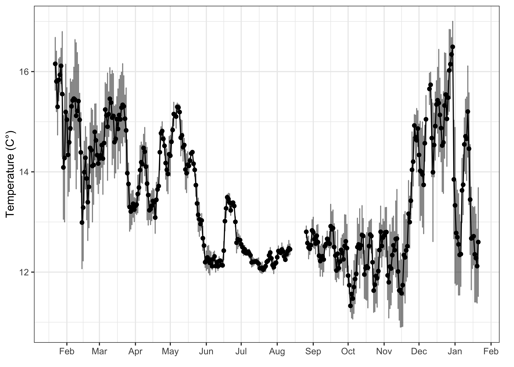
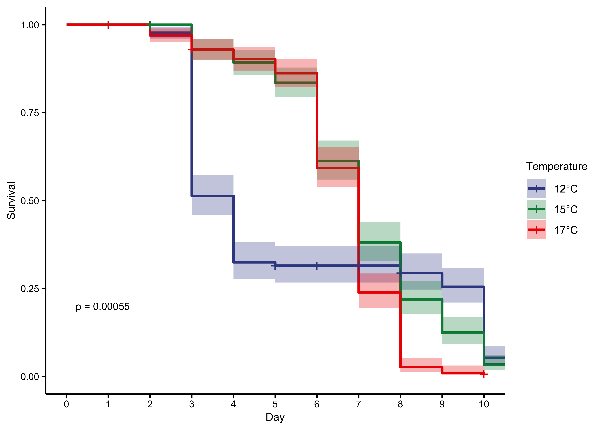
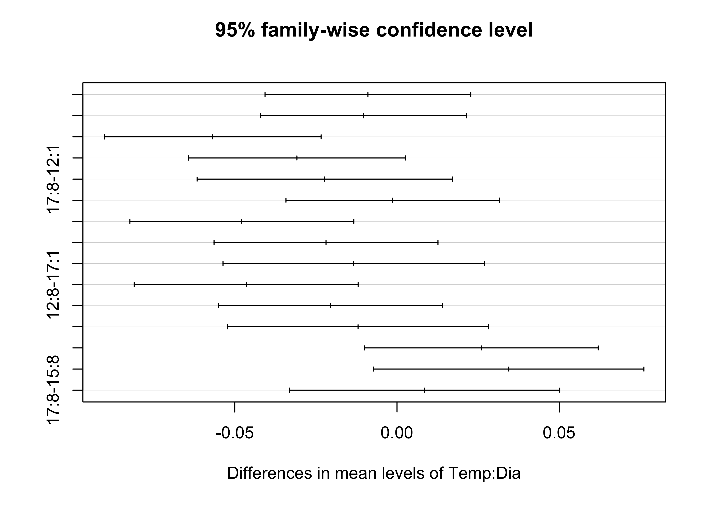
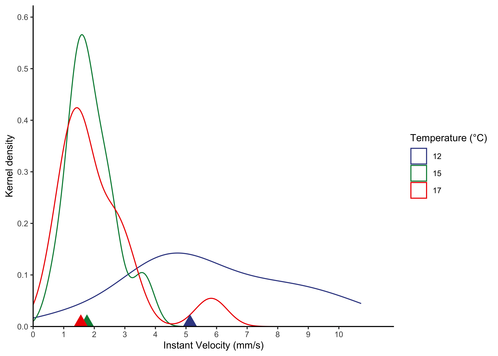
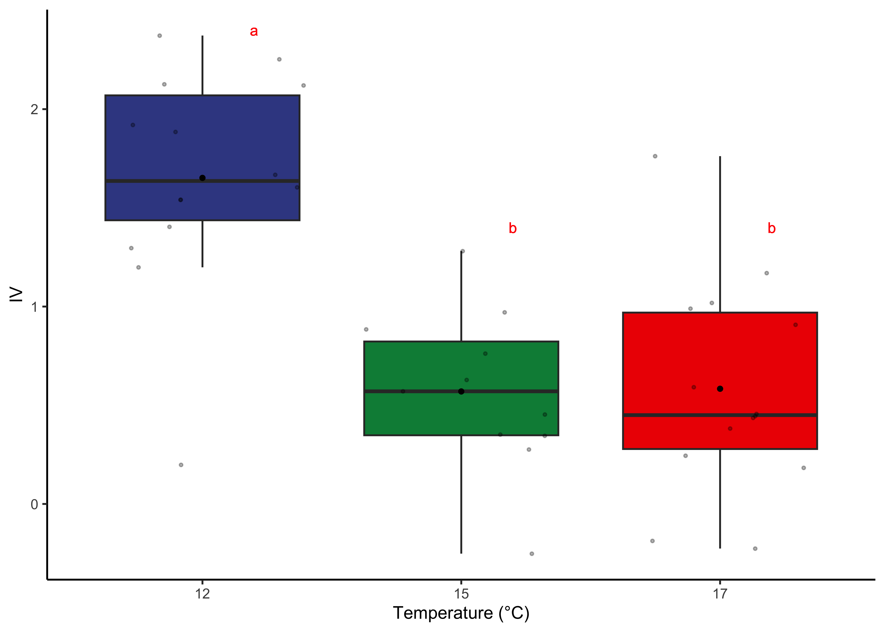
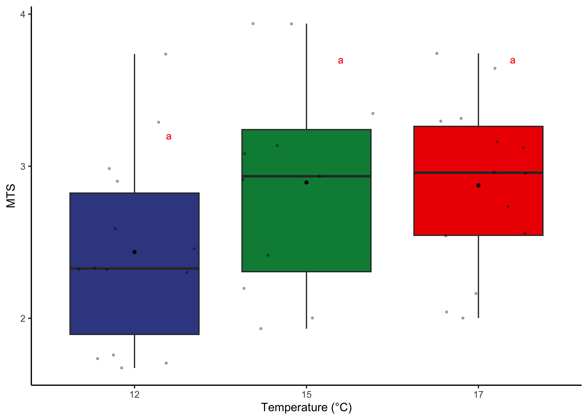

<sup>1</sup> Laboratorio de Ecofisiología y Ecología Evolutiva Marina
(e°CO2lab), Facultad de Ciencias del mar y de Recursos Naturales,
Universidad de Valparaíso, Viña del Mar, Chile.

<sup>2</sup> Centro de Observación Marino para Estudios de Riesgos del
Ambiente Costero (COSTA-R), Universidad de Valparaíso, Chile

<sup>3</sup> Laboratorio de Ictiología e Interacciones Biofíscas
(LABITI), Facultad de Ciencias, Universidad de Valparaíso, Valparaiso,
Chile

<sup>4</sup> Estación Costera de Investigaciones Marinas (ECIM),
Pontificia Universidad Católica de Chile, Las Cruces, Chile.

<sup>5</sup> Center for Applied Ecology and Sustainability (CAPES),
COPAS COASTAL, Instituto Milenio en Socioecología Costera, SECOS,
Pontificia Universidad Católica de Chile, Santiago, Chile.

<sup>6</sup> Center for Oceanographic Research COPAS Coastal, Universidad de Concepción, Chile 


This document reproduces and supports all data work and statistical
analysis of the larval survival, geometric morphometrics and swimming
activity in the paper **"Assessing the effect of temperature variability
on the swimming performance, survival and morphometrics of zoea larvae
of the kelp crab *Taliepus dentatus*"**.

# Libraries


```r
#Mortality libraries
library(cowplot)
library(scales)
library(dplyr)
library(gridExtra)
library(tidyverse) 
library(ggsci)
library(Rmisc)
library(survminer)
library(survival)
library(MASS)
library(here)


#Morphometrics Libraries 
library(Morpho)
library(geomorph)
library(shapes)
library(StereoMorph)
library(readr)
library(ggplot2)

#Swimming libraries
library(tidyverse)
library(lme4)
library(plyr)
library(lmerTest)
library(lme4)
library(car)
library(sjPlot)
library(effects)
library(cowplot)
library(emmeans)
library(sjPlot)
library(multcomp)
library(rlist)
```

# Timeseries of environmental temperature


```r
montemar<-read.table(here("Montemar-minidot", "miniDOT.dat"))

#MAKING DATETIME COLUMN and ADDING COLUMNS GROUPS
montemar_date <- montemar %>%
  unite("date", V1:V3, sep = "-")
montemar_date$date<-anytime::anydate(montemar_date$date)

montemar_date$jd <- yday(montemar_date$date)  
montemar_date$day<-day(montemar_date$date)
montemar_date$month<-month(montemar_date$date)
montemar_date$year<-year(montemar_date$date)

#mean temperature by days
Day_temp<-montemar_date %>%        
  group_by(year,month, day) %>%   
  dplyr::summarize(mean_temp = mean(V6), SD=sd(V6))  
Day_temp<-Day_temp %>% mutate(Date = make_date(year, month, day))
Day_temp<-Day_temp[1:365,] #RUN TO TAKE ONLY FIRST YEAR (2021 JAN-2022 JAN)
Day_temp$month<-as.factor(Day_temp$month)

#mean temperature by month
Month_temp <- montemar_date %>% 
  group_by(year,month) %>%  
  dplyr::summarize(mean_temp = mean(V6, na.rm=T), SD=sd(V6,na.rm=T), n=n())

Month_temp
```

```
## # A tibble: 22 × 5
## # Groups:   year [2]
##     year month mean_temp    SD     n
##    <dbl> <dbl>     <dbl> <dbl> <int>
##  1  2021     1      15.4 1.07   1342
##  2  2021     2      14.5 1.07   4032
##  3  2021     3      14.6 0.953  4464
##  4  2021     4      13.9 0.611  4320
##  5  2021     5      14.1 0.888  4464
##  6  2021     6      12.6 0.521  4320
##  7  2021     7      12.2 0.159  4464
##  8  2021     8      12.5 0.198  4464
##  9  2021     9      12.5 0.410  4320
## 10  2021    10      12.2 0.644  4464
## # ℹ 12 more rows
```

```r
ggplot(Day_temp, aes(x=Date, y=mean_temp)) + geom_point() + geom_line()+ theme_bw() + scale_x_date(date_labels = "%b", date_breaks = "1 month") + 
  geom_errorbar(aes(ymin=Day_temp$mean_temp-SD, ymax=Day_temp$mean_temp+SD), 
                width=.2, position=position_dodge(0.05),alpha=0.5) +
  labs(y="Temperature (C°)")+ theme(plot.margin = margin(0.2,0.5,0.2,0.2, "cm")) + labs(x=element_blank())
```

<!-- -->

# Mortality

## 1. Import of data base and definition of factors


```r
#data are available in the online version of the article, remember to import environment 
Mort <- read.delim(here::here("mortality/mort.txt"))
Mort$bino<-Mort$alive/100

#Temperature as factor
Mort$Temperature<-as.factor(Mort$Temperature)
```

## 2. Data summary


```r
# SD, SE, CI and  MEAN
LT50_summary<- summarySE(Mort, measurevar="bino",
                         groupvars=c("Temperature","Day"))
head(LT50_summary)
```

```
##   Temperature Day N      bino          sd          se         ci
## 1          12   1 3 1.0000000 0.000000000 0.000000000 0.00000000
## 2          12   2 3 0.9766667 0.005773503 0.003333333 0.01434218
## 3          12   3 3 0.5000000 0.115325626 0.066583281 0.28648474
## 4          12   4 3 0.3066667 0.210792157 0.121700908 0.52363675
## 5          12   5 3 0.2966667 0.202319879 0.116809436 0.50259044
## 6          12   6 3 0.2966667 0.202319879 0.116809436 0.50259044
```

## 3. Generalized Lineal Model (GLM) analysis and LT50%


```r
#separation of the table by temp 
mort_12<-LT50_summary[1:11, ]
mort_15<-LT50_summary[12:22, ]
mort_17<-LT50_summary[23:32,]

#GLM analysis for 12°C
model1<-glm(data=mort_12, bino ~ Day, family=quasibinomial())
summary(model1)
```

```
## 
## Call:
## glm(formula = bino ~ Day, family = quasibinomial(), data = mort_12)
## 
## Deviance Residuals: 
##     Min       1Q   Median       3Q      Max  
## -0.5179  -0.2999  -0.0738   0.3400   0.5964  
## 
## Coefficients:
##             Estimate Std. Error t value Pr(>|t|)   
## (Intercept)   2.1710     0.6380   3.403  0.00784 **
## Day          -0.4791     0.1117  -4.289  0.00202 **
## ---
## Signif. codes:  0 '***' 0.001 '**' 0.01 '*' 0.05 '.' 0.1 ' ' 1
## 
## (Dispersion parameter for quasibinomial family taken to be 0.1436587)
## 
##     Null deviance: 5.4993  on 10  degrees of freedom
## Residual deviance: 1.5399  on  9  degrees of freedom
## AIC: NA
## 
## Number of Fisher Scoring iterations: 5
```

```r
#GLM analysis for 15°C
model2<-glm(data=mort_15, bino ~ Day, family=quasibinomial())
summary(model2)
```

```
## 
## Call:
## glm(formula = bino ~ Day, family = quasibinomial(), data = mort_15)
## 
## Deviance Residuals: 
##       Min         1Q     Median         3Q        Max  
## -0.185582  -0.053923  -0.005199   0.088830   0.186640  
## 
## Coefficients:
##             Estimate Std. Error t value Pr(>|t|)    
## (Intercept)  5.84038    0.37027   15.77 7.28e-08 ***
## Day         -0.89940    0.05508  -16.33 5.39e-08 ***
## ---
## Signif. codes:  0 '***' 0.001 '**' 0.01 '*' 0.05 '.' 0.1 ' ' 1
## 
## (Dispersion parameter for quasibinomial family taken to be 0.01151942)
## 
##     Null deviance: 8.21286  on 10  degrees of freedom
## Residual deviance: 0.13672  on  9  degrees of freedom
## AIC: NA
## 
## Number of Fisher Scoring iterations: 6
```

```r
#GLM analysis for 17°C
model3<-glm(data=mort_17, bino ~ Day, family=quasibinomial())
summary(model3)
```

```
## 
## Call:
## glm(formula = bino ~ Day, family = quasibinomial(), data = mort_17)
## 
## Deviance Residuals: 
##       Min         1Q     Median         3Q        Max  
## -0.287545  -0.221565  -0.146333  -0.006668   0.263467  
## 
## Coefficients:
##             Estimate Std. Error t value Pr(>|t|)    
## (Intercept)   6.6331     0.9512   6.974 0.000116 ***
## Day          -1.1205     0.1559  -7.186 9.37e-05 ***
## ---
## Signif. codes:  0 '***' 0.001 '**' 0.01 '*' 0.05 '.' 0.1 ' ' 1
## 
## (Dispersion parameter for quasibinomial family taken to be 0.05103717)
## 
##     Null deviance: 8.41356  on 9  degrees of freedom
## Residual deviance: 0.38809  on 8  degrees of freedom
## AIC: NA
## 
## Number of Fisher Scoring iterations: 6
```

```r
#Dose.p function to find moment at which 50% of the population has died (LT50%) based in the glm models made above

#LT50% for 12°C
dose.p(model1, p = 0.5)
```

```
##              Dose        SE
## p = 0.5: 4.531844 0.6121778
```

```r
#LT50% for 15°C
dose.p(model2, p = 0.5)
```

```
##              Dose      SE
## p = 0.5: 6.493628 0.11405
```

```r
#LT50% for 17°C
dose.p(model3, p = 0.5)
```

```
##              Dose        SE
## p = 0.5: 5.919705 0.2142654
```

```r
# LT50% values with their CI
lt50<-c(4.531844, 6.493628, 5.919705)
CI<-c(0.6121778*1.95, 0.11405*1.95, 0.2142654*1.95)
temp<-c(12, 15,17)
data_final<-data.frame(temp,lt50, CI)
data_final$temp<-as.factor(data_final$temp)
data_final
```

```
##   temp     lt50        CI
## 1   12 4.531844 1.1937467
## 2   15 6.493628 0.2223975
## 3   17 5.919705 0.4178175
```

## 4. Kaplan-Meier Analysis


```r
#Vector for creating correct data table
repV<- Mort$dead 
  repV[repV=="0"]<-1

#Datatable KAP for analysis
KAP<-Mort %>%
  mutate(count = repV) %>%
  uncount(count)

# Adding Status column (binary in which 1=no death; 2=death on that day)
KAP$STATUS <- ifelse (KAP$dead==0, 1, 2)
survObj <- Surv(time=KAP$Day, event=KAP$STATUS==2)

#Kaplan-Meier analysis 
sfit <- survfit(Surv(Day, STATUS)~Temperature, data=KAP)
summary(sfit)
```

```
## Call: survfit(formula = Surv(Day, STATUS) ~ Temperature, data = KAP)
## 
##                 Temperature=12 
##  time n.risk n.event survival std.err lower 95% CI upper 95% CI
##     2    308       7   0.9773 0.00849       0.9608       0.9941
##     3    301     143   0.5130 0.02848       0.4601       0.5720
##     4    158      58   0.3247 0.02668       0.2764       0.3814
##     5    100       3   0.3149 0.02647       0.2671       0.3713
##     8     90       6   0.2939 0.02605       0.2471       0.3497
##     9     83      11   0.2550 0.02511       0.2102       0.3093
##    10     72      57   0.0531 0.01328       0.0325       0.0867
##    11     15      15   0.0000     NaN           NA           NA
## 
##                 Temperature=15 
##  time n.risk n.event survival std.err lower 95% CI upper 95% CI
##     3    297      21   0.9293  0.0149       0.9006       0.9589
##     4    276      11   0.8923  0.0180       0.8577       0.9282
##     5    265      17   0.8350  0.0215       0.7939       0.8783
##     6    248      66   0.6128  0.0283       0.5598       0.6708
##     7    182      69   0.3805  0.0282       0.3291       0.4399
##     8    113      48   0.2189  0.0240       0.1765       0.2713
##     9     65      28   0.1246  0.0192       0.0922       0.1684
##    10     37      27   0.0337  0.0105       0.0183       0.0619
##    11     10      10   0.0000     NaN           NA           NA
## 
##                 Temperature=17 
##  time n.risk n.event survival std.err lower 95% CI upper 95% CI
##     2    298       9  0.96980 0.00991      0.95056       0.9894
##     3    289      12  0.92953 0.01483      0.90092       0.9590
##     4    276       8  0.90259 0.01719      0.86952       0.9369
##     5    268      12  0.86217 0.01999      0.82387       0.9023
##     6    256      80  0.59274 0.02851      0.53942       0.6513
##     7    176     105  0.23912 0.02475      0.19521       0.2929
##     8     71      63  0.02694 0.00940      0.01360       0.0534
##     9      8       5  0.01010 0.00580      0.00328       0.0311
##    10      3       1  0.00674 0.00475      0.00169       0.0268
```

```r
#Ploting Kaplan-meier results
ggsurvplot(sfit, conf.int=TRUE, pval=TRUE, risk.table=FALSE, 
           legend.labs=c("12°C", "15°C","17°C"),
           legend.title="Temperature",  
           palette=(c("blue", "orange", "red")), 
           risk.table.height=.15, ylab="Survival", xlab="Day")
```

<!-- -->

*Fig 1. Kaplan-meier survival curve (lines) for each temperature with
their confidence interval (shaded color)*

------------------------------------------------------------------------

# Geometric Morphometrics

##Digitizing


```r
curve.v1<- c("organo_dorsal","esq_izq_caparaza")
curve.v2<- c("punta_espina_dorsal","punta_espina_dorsal")
curve.v3<- c("curvaD_espina_dorsal","curvaI_espina_dorsal")
curve<- matrix(c(curve.v3,curve.v2, curve.v1), ncol = 3)
# take-off "#" of the digitizeimages function in order to visualize each picture digitalization on rmarkdown. 
#digitizeImages(image.file="morphometric larva/ZOEA1_FOTOS/12°C", landmarks.ref="morphometric larva/landmarks.txt", curves.ref = curve, shapes.file ="morphometric larva/zoea1")
#digitizeImages(image.file="morphometric larva/ZOEA1_FOTOS/15°C", landmarks.ref="morphometric larva/landmarks.txt", curves.ref = curve, shapes.file ="morphometric larva/zoea1")
#digitizeImages(image.file="morphometric larva/ZOEA1_FOTOS/17°C", landmarks.ref="morphometric larva/landmarks.txt", curves.ref = curve, shapes.file ="morphometric larva/zoea1")
```

## 1. Import Digitized pictures, grouping files and links for landmarks


```r
#data are available in the online version of the article, remember to import environment 
DIGIDAT<-readShapes(here::here("morphometric/zoea1"))

# Telling R the database is from steremorph
array_data<-readland.shapes(DIGIDAT, nCurvePts= c(7,7))

# Importing traits
traitF<- read_delim("/Users/lucasb/Desktop/ECOLAB!/paper tesis/morphometric larva/trait1.txt", 
                    delim = "\t", escape_double = FALSE, 
                    trim_ws = TRUE)
head(traitF)
```

```
## # A tibble: 6 × 5
##   ID          Hours  Temp Replica   Day
##   <chr>       <dbl> <dbl>   <dbl> <dbl>
## 1 12_1_IND1_C    12    12       1     1
## 2 12_1_IND1_D    12    12       1     1
## 3 12_1_IND1_I    12    12       1     1
## 4 12_1_IND2_C    12    12       2     1
## 5 12_1_IND2_D    12    12       2     1
## 6 12_1_IND2_I    12    12       2     1
```

```r
# assigning columns as factors
traitF$Temp<- as.factor(traitF$Temp)
traitF$Replica<-as.factor(traitF$Replica)
traitF$Day<-as.factor(traitF$Day)

# importing file linksgeo to create lines connections between landmarks and semilandmarks
linksgeo <- read_delim("/Users/lucasb/Desktop/ECOLAB!/paper tesis/morphometric larva/links.txt", delim = "\t", 
                    escape_double = FALSE, col_names = FALSE, 
                    trim_ws = TRUE)
linksgeo<-as.matrix(linksgeo)
```

## 2. Generalized Procrustes Analysis (GPA)


```r
#Generalized Procrustes Analysis
GPA<- gpagen(array_data,ProcD=FALSE, print.progress = FALSE, curves=array_data$curves) 
#procD=false, bending energy is the correct criterion for optimizing the positions of semilandmarks

gdf<- geomorph.data.frame(GPA, Temp=traitF$Temp, replica=traitF$Replica)
```

## 3. Principal Components Analysis (PCA)


```r
# Mean shape of all the individuals and adding links and numbers for each landmark and semilandmark
msh <- mshape(GPA$coords)
plot(msh, links = linksgeo)
```

<!-- -->

```r
# plot of all landmarks and semilandmarks digitized in grey and mean shape in black
plotAllSpecimens(GPA$coords, links = linksgeo, plot.param = list(txt.cex = 1.5, txt.col = "#D53E4F", pt.bg = "#BDBDBD", link.col = "black", mean.bg = "black"))
```

<!-- -->

```r
# Principal Components Analysis 
PCA<-gm.prcomp(GPA$coords)
summary(PCA)
```

```
## 
## Ordination type: Principal Component Analysis 
## Centering by OLS mean
## Orthogonal projection of OLS residuals
## Number of observations: 57 
## Number of vectors 33 
## 
## Importance of Components:
##                              Comp1        Comp2        Comp3        Comp4
## Eigenvalues            0.001663143 0.0009952127 0.0007084004 0.0005026865
## Proportion of Variance 0.344256689 0.2060006993 0.1466329435 0.1040518979
## Cumulative Proportion  0.344256689 0.5502573882 0.6968903317 0.8009422296
##                               Comp5        Comp6        Comp7        Comp8
## Eigenvalues            0.0003263609 0.0002361839 0.0001091267 8.809108e-05
## Proportion of Variance 0.0675539785 0.0488880929 0.0225883065 1.823412e-02
## Cumulative Proportion  0.8684962081 0.9173843010 0.9399726075 9.582067e-01
##                               Comp9       Comp10       Comp11       Comp12
## Eigenvalues            0.0000538088 4.697673e-05 2.731572e-05 0.0000227029
## Proportion of Variance 0.0111379705 9.723791e-03 5.654126e-03 0.0046993105
## Cumulative Proportion  0.9693446944 9.790685e-01 9.847226e-01 0.9894219213
##                              Comp13       Comp14       Comp15       Comp16
## Eigenvalues            0.0000169546 8.878019e-06 8.338615e-06 4.809795e-06
## Proportion of Variance 0.0035094592 1.837676e-03 1.726023e-03 9.955873e-04
## Cumulative Proportion  0.9929313806 9.947691e-01 9.964951e-01 9.974907e-01
##                              Comp17       Comp18       Comp19       Comp20
## Eigenvalues            3.339880e-06 2.629547e-06 2.110745e-06 1.387480e-06
## Proportion of Variance 6.913272e-04 5.442942e-04 4.369066e-04 2.871968e-04
## Cumulative Proportion  9.981820e-01 9.987263e-01 9.991632e-01 9.994504e-01
##                              Comp21       Comp22       Comp23       Comp24
## Eigenvalues            1.221668e-06 7.846171e-07 5.547431e-07 4.480001e-08
## Proportion of Variance 2.528751e-04 1.624092e-04 1.148272e-04 9.273227e-06
## Cumulative Proportion  9.997033e-01 9.998657e-01 9.999805e-01 9.999898e-01
##                              Comp25       Comp26       Comp27       Comp28
## Eigenvalues            1.811106e-08 1.023950e-08 8.629042e-09 4.528716e-09
## Proportion of Variance 3.748837e-06 2.119490e-06 1.786139e-06 9.374063e-07
## Cumulative Proportion  9.999935e-01 9.999956e-01 9.999974e-01 9.999984e-01
##                              Comp29       Comp30       Comp31       Comp32
## Eigenvalues            3.781360e-09 2.209234e-09 1.190465e-09 7.020675e-10
## Proportion of Variance 7.827099e-07 4.572929e-07 2.464163e-07 1.453221e-07
## Cumulative Proportion  9.999992e-01 9.999996e-01 9.999999e-01 1.000000e+00
##                              Comp33
## Eigenvalues            9.145980e-19
## Proportion of Variance 1.893141e-16
## Cumulative Proportion  1.000000e+00
```

```r
# Principal components analysis by replica
AnError<-procD.lm(coords~replica, data = gdf, iter = 999, RRPP = TRUE)

summary(AnError)
```

```
## 
## Analysis of Variance, using Residual Randomization
## Permutation procedure: Randomization of null model residuals 
## Number of permutations: 1000 
## Estimation method: Ordinary Least Squares 
## Sums of Squares and Cross-products: Type I 
## Effect sizes (Z) based on F distributions
## 
##           Df       SS        MS     Rsq      F     Z Pr(>F)   
## replica   18 0.229134 0.0127297 0.84694 11.682 12.72  0.001 **
## Residuals 38 0.041408 0.0010897 0.15306                       
## Total     56 0.270542                                         
## ---
## Signif. codes:  0 '***' 0.001 '**' 0.01 '*' 0.05 '.' 0.1 ' ' 1
## 
## Call: procD.lm(f1 = coords ~ replica, iter = 999, RRPP = TRUE, data = gdf)
```

```r
(0.0127297/0.0138194)*100
```

```
## [1] 92.11471
```

```r
# Error explained by miss-digitazion (%)
(0.0010897/0.0138194)*100 
```

```
## [1] 7.885292
```


```r
# Taking out PCA coordinates to create a plot with ggplot
df_out <- as.data.frame(PCA$x)

# ggplot for the PC1 and PC2
PCA1<-ggplot(data=df_out, aes(x=Comp1, y=Comp2, col=
                          gdf$Temp)) + geom_point(size=3, show.legend = FALSE) + theme_light() + labs(x="PC1=34.4%", y="PC2=20.6%") + scale_color_manual(values =c("blue","orange", "red"))
PCA1
```

<!-- -->

*Fig 3a. First (PC1) and second (PC2) principal components distribution
with their explained variance (%)*


```r
# Plots of the mean shape (grey) against mínimum shape (black) of PC1 (with default magnification=1)
plotRefToTarget(msh, PCA$shapes$shapes.comp1$min, method =  "points", 
                links = linksgeo)

# Plots of the mean shape (grey) against maximum shape (black) of PC1 (with default magnification=1)
plotRefToTarget(msh, PCA$shapes$shapes.comp1$max,method = "points", 
                links = linksgeo)

# Plots of the mean shape (grey) against mínimum shape (black) of PC2 (with default magnification=1)
plotRefToTarget(msh, PCA$shapes$shapes.comp2$min, method =  "points", 
                links = linksgeo)

# Plots of the mean shape (grey) against maximum shape (black) of PC2 (with default magnification=1)
plotRefToTarget(msh, PCA$shapes$shapes.comp2$max,method = "points", 
                links = linksgeo)
```


```r
# ggplot for the PC1 and PC3
PCA2<-ggplot(data=df_out, aes(x=Comp1, y=Comp3, col=
      gdf$Temp))+geom_point(size=3) + theme_light() +
  labs(x="PC1=34.4%", y="PC3=14.6%", shape="Day", col="Temperature")+ scale_color_manual(values =c("blue", "orange", "red"))
PCA2
```

<!-- -->

*Fig 3b. First (PC1) and second (PC3) principal components distribution
with their explained variance (%)*


```r
# Plots of the mean shape (grey) against mínimum shape (black) of PC1 (with default magnification=1)
plotRefToTarget(msh, PCA$shapes$shapes.comp1$min, method =  "points",
                links = linksgeo)

# Plots of the mean shape (grey) against maximum shape (black) of PC1 (with default magnification=1)
plotRefToTarget(msh, PCA$shapes$shapes.comp1$max,method = "points",
                links = linksgeo)

# Plots of the mean shape (grey) against mínimum shape (black) of PC3 (with default magnification=1)
plotRefToTarget(msh, PCA$shapes$shapes.comp3$min, method =  "points",
                links = linksgeo)

# Plots of the mean shape (grey) against maximum shape (black) of PC3 (with default magnification=1)
plotRefToTarget(msh, PCA$shapes$shapes.comp3$max,method = "points",
                links = linksgeo)
```

## 4. Canonical Variance Analysis (CVA)


```r
# Column to the Database to later use as grouping
traitF$grouppp<-paste(traitF$Temp, traitF$Day)

# Canonical variance analysis using bonferroni p-value adjustment 
cva1<-CVA(GPA$coords, groups = traitF$Temp, p.adjust.method = "bonferroni",rounds = 1000, robust = "classical")
```

```
## singular Covariance matrix: General inverse is used. Threshold for zero eigenvalue is 1e-10
```

```r
# P-values (euclides) obtained between groups
(cva1[["Dist"]][["probsEuclid"]])
```

```
##             12          15
## 15 0.002997003            
## 17 0.095904096 0.002997003
```

```r
# Procrustes distances (euclides) between groups
(cva1[["Dist"]][["GroupdistEuclid"]])
```

```
##            12         15
## 15 0.06321077           
## 17 0.03565455 0.04666779
```

```r
Cva_out<-as.data.frame(cva1$CVscores)
consensus<-as.data.frame(cva1$groupmeans)
Cva_out$temp<-gdf$Temp

ggplot(data=Cva_out, aes(x=`CV 1`, y=`CV 2`, col=temp)) + geom_point() + stat_ellipse(level = 0.95) + coord_fixed() +
labs(x="Canonical variable 1 (76.4%)", y= "Canonical variable 2 (23.6%)", col= "Temperature") + theme_classic() + scale_color_manual(values =c("blue", "orange", "red"), labels=c("12°C","15°C","17°C"))
```

<!-- -->

```r
plotRefToTarget(cva1[["Grandm"]], cva1[["groupmeans"]][,,1], method ="points", links = linksgeo, axes = TRUE, label = FALSE, gridPars = gridPar(tar.pt.bg = "blue", tar.link.col="blue",tar.link.lwd=2, link.col = "grey", pt.bg = "grey", link.lwd = 2, pt.size = 1, tar.pt.size = 1.5))
```

<!-- -->

```r
plotRefToTarget(cva1[["Grandm"]], cva1[["groupmeans"]][,,2], method ="points", links = linksgeo, axes = TRUE, label = FALSE, gridPars = gridPar(tar.pt.bg = "orange", tar.link.col="orange",tar.link.lwd=2, link.col = "grey", pt.bg = "grey", link.lwd = 2, pt.size = 1, tar.pt.size = 1.5))
```

<!-- -->

```r
plotRefToTarget(cva1[["Grandm"]], cva1[["groupmeans"]][,,3], method ="points", links = linksgeo, axes = TRUE, label = FALSE, gridPars = gridPar(tar.pt.bg = "red", tar.link.col="red",tar.link.lwd=2, link.col = "grey", pt.bg = "grey", link.lwd = 2, pt.size = 1, tar.pt.size = 1.5))
```

<!-- -->

------------------------------------------------------------------------

# Swimming Performance

## 1. Import database and Tyding


```r
#data are available in the online version of the article, remember to import environment 
list_of_files <- list.files(path = here::here("swimming R/NEW TRIAL/data"), recursive = TRUE,pattern = "\\.txt$", full.names = TRUE)

#Lapply allows to import all the files in one list
loop_full<-lapply(list_of_files, read.delim2)
names(loop_full)<-list_of_files
loop_full<-lapply(loop_full, function(x) { x["frame"] <- NULL; x })
```


```r
mean_t1_12<-list()
# for loop to make same functions to all files of 12°C 
for (i in 1:14){ a=loop_full[[i]][,]
a$x<-as.numeric(a$x)
a$y<-as.numeric(a$y)
df<-a %>%
  group_by(X) %>%
  mutate(XX = x - lag(x)) %>% #Distance difference in x axis  between two points
  mutate(Y = y - lag(y)) #Distance difference in y axis between two points
df$time<-as.POSIXct(df$time, format="%M:%OS")
df$tdif<-ifelse(difftime(df$time,lag(df$time), units = "secs")<1,difftime(df$time,lag(df$time), units = "secs"),NA)
z1<-aggregate(df$tdif, by=list(Trajectory=df$X), FUN=sum, na.rm=T)
df$iv <- (sqrt((df$XX)^2+(df$Y)^2))/0.125 #Instant velocity
z1$IV <- aggregate(df$iv, list(df$X), FUN = mean, na.rm=TRUE)[,2] #Mean velocity by larvae
mean_t1_12[[i]]<-z1
}
names(mean_t1_12)<-list_of_files[1:14] #rownames

# Tidying columns Temp, aquarium and larva.
mean_t1_12<- list.rbind(mean_t1_12)
mean_t1_12$larva<-c(1,2,2,3,3,3,3,4,4,4,5,5,5,5,1,1,2,2,3,3,3,4,4,4,5,1,2,2,2,4,5,5,5)
mean_t1_12$aquarium<-c("A","A", "A", "A", "A", "A" ,"A", "A", "A", "A", "A", "A", "A", "A", "B", "B", "B", "B","B", "B", "B", "B", "B", "B", "B", "C", "C", "C", "C", "C", "C", "C", "C")
mean_t1_12$temp<-rep(12)
mean_t1_12<-mean_t1_12[, c(6,5,4, 1, 2, 3)]
colnames(mean_t1_12)<-c("Temp","aquarium","Larva","Trajectory","Time","IV")
```


```r
mean_t1_15<-list()
# for loop to make same functions to all files of 15°C 
for (i in 15:25){ a=loop_full[[i]][,]
a$x<-as.numeric(a$x)
a$y<-as.numeric(a$y)
df<-a %>%
  group_by(X) %>%
  mutate(XX = x - lag(x)) %>% #Distance difference in x axis  between two points
  mutate(Y = y - lag(y)) #Distance difference in y axis between two points
df$time<-as.POSIXct(df$time, format="%M:%OS")
df$tdif<-ifelse(difftime(df$time,lag(df$time), units = "secs")<1,difftime(df$time,lag(df$time), units = "secs"),NA)
z1<-aggregate(df$tdif, by=list(Trajectory=df$X), FUN=sum, na.rm=T)
df$iv <- (sqrt((df$XX)^2+(df$Y)^2))/0.125 #Instant velocity 
z1$IV <- aggregate(df$iv, list(df$X), FUN = mean, na.rm=TRUE)[,2] #Mean velocity by larvae
mean_t1_15[[i]]<-z1
}
mean_t1_15<-mean_t1_15[c(15:25)]
names(mean_t1_15)<-list_of_files[15:25] #rownames

# Tidying columns Temp, aquarium and larva with rownames
mean_t1_15<- list.rbind(mean_t1_15)
mean_t1_15$larva<-c(1,1,1,2,2,2,2,2,2,3,3,3,3,3,3,3,3,3,5,5,1,1,1,1,1,2,2,2,2,2,2,2,3,1,2,2,2,2,2,3,3,5,5)
mean_t1_15$aquarium<-c("A", "A", "A", "A", "A", "A", "A", "A", "A", "A", "A", "A", "A", "A", "A", "A", "A", "A", "A", "A", "B", "B", "B", "B", "B", "B", "B", "B", "B", "B", "B", "B", "B", "C", "C", "C","C", "C", "C", "C", "C", "C", "C")
mean_t1_15$temp<-rep(15)
mean_t1_15<-mean_t1_15[, c(6,5,4, 1, 2, 3)]
colnames(mean_t1_15)<-c("Temp","aquarium","Larva","Trajectory","Time","IV")
```


```r
mean_t1_17<-list()
# for loop to make same functions to all files of 17°C 
for (i in 26:39){ a=loop_full[[i]][,]
a$x<-as.numeric(a$x)
a$y<-as.numeric(a$y)
df<-a %>%
  group_by(X) %>%
  mutate(XX = x - lag(x)) %>% #Distance difference in x axis  between two points
  mutate(Y = y - lag(y)) #Distance difference in y axis between two points
df$time<-as.POSIXct(df$time, format="%M:%OS")
df$tdif<-ifelse(difftime(df$time,lag(df$time), units = "secs")<1,difftime(df$time,lag(df$time), units = "secs"),NA)
z1<-aggregate(df$tdif, by=list(Trajectory=df$X), FUN=sum, na.rm=T)
df$iv <- (sqrt((df$XX)^2+(df$Y)^2))/0.125 #Instant velocity 
z1$IV <- aggregate(df$iv, list(df$X), FUN = mean, na.rm=TRUE)[,2] #Mean velocity by larvae
mean_t1_17[[i]]<-z1
}
mean_t1_17<-mean_t1_17[c(26:39)]
names(mean_t1_17)<-list_of_files[26:39] #rownames

# Tidying columns Temp, aquarium and larva with rownames
mean_t1_17<- list.rbind(mean_t1_17)
mean_t1_17$larva<-c(1,1,1,1,2,2,2,2,3,3,3,4,4,4,5,5,5,2,2,3,3,3,3,3,3,3,3,3,3,4,4,5,5,5,5,1,1,1,1,1,1,1,2,2,2,2,2,2,3,3,3,3,3,4,4,4,5,5,5,5,5,5)
mean_t1_17$aquarium<-c("A", "A", "A", "A", "A", "A", "A", "A", "A", "A", "A", "A", "A", "A", "A", "A", "A", "B","B", "B", "B", "B", "B", "B", "B", "B", "B", "B", "B", "B", "B", "B", "B", "B", "B", "C","C", "C", "C", "C", "C", "C", "C", "C", "C", "C", "C", "C", "C", "C", "C", "C", "C", "C","C", "C", "C", "C", "C", "C", "C", "C")
mean_t1_17$temp<-rep(17)
mean_t1_17<-mean_t1_17[, c(6,5,4, 1, 2, 3)]
colnames(mean_t1_17)<-c("Temp","aquarium","Larva","Trajectory","Time","IV")
data<-rbind(mean_t1_12,mean_t1_15,mean_t1_17)
```


```r
#Tidying data
data1<-data%>%group_by(Temp,aquarium,Larva) %>%
  dplyr::summarise(Ist_Vel = mean(IV),
                   Tot_Time= sum(Time), Max_Time=max(Time))%>%rowid_to_column(var='ID')
data1$Temp<-as.factor(data1$Temp)
```


```r
#Median of instant velocity by temp
medIV <- ddply(data1, "Temp", summarise, grp.med=median(Ist_Vel), Q1=quantile(Ist_Vel, c(0.25), type = 6),Q3=quantile(Ist_Vel, c(0.75), type = 6), IQR=Q3-Q1)
print(medIV)
```

```
##   Temp  grp.med       Q1       Q3      IQR
## 1   12 5.138207 3.964596 8.341095 4.376499
## 2   15 1.769275 1.411203 2.419496 1.008293
## 3   17 1.568503 1.257316 2.711036 1.453720
```

```r
#Median of max time swimming by temp
medMax <- ddply(data1, "Temp", summarise, grp.med=median(Max_Time),
Q1=quantile(Max_Time, c(0.25), type = 6),Q3=quantile(Max_Time, c(0.75), type = 6), IQR=Q3-Q1)
print(medMax)
```

```
##   Temp grp.med      Q1     Q3     IQR
## 1   12   10.25  5.7675 18.590 12.8225
## 2   15   18.80  9.0000 28.400 19.4000
## 3   17   19.25 11.7000 27.125 15.4250
```

## 2. Kernel plots


```r
#Non-parametric Kernel Densities plot for instant velocity (IV)
dplot_IV<-ggplot(data1, aes(Ist_Vel, color=Temp))+
  geom_density(kernel = "gaussian")+
  geom_point(aes(x=5.13, y=0),colour="blue",shape=17, size=6)+
  geom_point(aes(x=1.76, y=0),colour="orange",shape=17, size=6)+
  geom_point(aes(x=1.56, y=0),colour="red",shape=17, size=6)+
  theme_classic()+ 
  labs(colour="Temperature", x="Instant Velocity (mm/s)", y="Kernel density")+ 
  scale_x_continuous(limits = c(0, NA), expand = expansion(mult = c(0, 0.1))) +
  scale_y_continuous(limits = c(0, NA),expand = expansion(mult = c(0, 0.1))) +
  theme(axis.title = element_text(size = 20),axis.text = element_text(size = 20)) +
  scale_colour_manual(values =c("blue","darkorange", "red"))
dplot_IV
```

<!-- -->

*Kernel density plot of instant velocity (IV) with their median
(triangle) by temperature*


```r
#Non-parametric Kernel Densities plot for max time swimming (MT)
dplot_Max<-ggplot(data1, aes(Max_Time, color=Temp))+
  geom_density(kernel="gaussian")+
  geom_point(aes(x=10.25, y=0),color="blue",shape=17, size=6)+
  geom_point(aes(x=18.80, y=0),color="orange",shape=17, size=6)+
  geom_point(aes(x=19.25, y=0),color="red",shape=17, size=6)+
  theme_classic()+
  labs(colour="Temperature", x="Max Time Swimming (sec)", y="Kernel density")+ 
  scale_x_continuous(limits = c(0, NA), expand = expansion(mult = c(0, 0.1))) +
  scale_y_continuous(limits = c(0, NA),expand = expansion(mult = c(0, 0.1))) +
  theme(axis.title = element_text(size = 20),axis.text = element_text(size = 20)) +
  scale_color_manual(values =c("blue","darkorange", "red"))
dplot_Max
```

<!-- -->

*Kernel density plot of max time swimming (MT) with their median
(triangle) by temperature*

## 3. Linear mixed effects model with log transformed data


```r
#Checking for normality
shapiro.test(log(data1$Ist_Vel))
```

```
## 
## 	Shapiro-Wilk normality test
## 
## data:  log(data1$Ist_Vel)
## W = 0.96203, p-value = 0.2082
```

```r
hist(log(data1$Ist_Vel))
```

<!-- -->

```r
shapiro.test(log(data1$Max_Time))
```

```
## 
## 	Shapiro-Wilk normality test
## 
## data:  log(data1$Max_Time)
## W = 0.96391, p-value = 0.2402
```

```r
hist(log(data1$Max_Time))
```

<!-- -->

```r
#Checking for heteroscedasticity
leveneTest(log(data1$Ist_Vel), data1$Temp)
```

```
## Levene's Test for Homogeneity of Variance (center = median)
##       Df F value Pr(>F)
## group  2  0.2995  0.743
##       36
```

```r
leveneTest(log(data1$Max_Time),data1$Temp)
```

```
## Levene's Test for Homogeneity of Variance (center = median)
##       Df F value Pr(>F)
## group  2  0.2195  0.804
##       36
```


```r
#Linear mixed effects model with Log transformed data of IV. aquarium is a factor with random effects and larva is nested in aquarium 
modIV<-lmer(log(Ist_Vel)~Temp + (aquarium|Larva), data=data1)
summary(modIV)
```

```
## Linear mixed model fit by REML. t-tests use Satterthwaite's method [
## lmerModLmerTest]
## Formula: log(Ist_Vel) ~ Temp + (aquarium | Larva)
##    Data: data1
## 
## REML criterion at convergence: 60.4
## 
## Scaled residuals: 
##     Min      1Q  Median      3Q     Max 
## -2.6676 -0.5143 -0.0327  0.5135  1.9865 
## 
## Random effects:
##  Groups   Name        Variance Std.Dev. Corr       
##  Larva    (Intercept) 0.039770 0.19942             
##           aquariumB   0.004512 0.06717   1.00      
##           aquariumC   0.002630 0.05128  -1.00 -1.00
##  Residual             0.228902 0.47844             
## Number of obs: 39, groups:  Larva, 5
## 
## Fixed effects:
##             Estimate Std. Error      df t value Pr(>|t|)    
## (Intercept)   1.6338     0.1566 10.4830  10.435 7.26e-07 ***
## Temp15       -1.1488     0.1961 32.8937  -5.857 1.49e-06 ***
## Temp17       -1.0795     0.1814 31.4611  -5.952 1.33e-06 ***
## ---
## Signif. codes:  0 '***' 0.001 '**' 0.01 '*' 0.05 '.' 0.1 ' ' 1
## 
## Correlation of Fixed Effects:
##        (Intr) Temp15
## Temp15 -0.550       
## Temp17 -0.590  0.459
## optimizer (nloptwrap) convergence code: 0 (OK)
## boundary (singular) fit: see help('isSingular')
```

```r
anova(modIV)
```

```
## Type III Analysis of Variance Table with Satterthwaite's method
##      Sum Sq Mean Sq NumDF  DenDF F value    Pr(>F)    
## Temp 10.937  5.4685     2 32.411   23.89 4.209e-07 ***
## ---
## Signif. codes:  0 '***' 0.001 '**' 0.01 '*' 0.05 '.' 0.1 ' ' 1
```

```r
#model diagnostic
plot(modIV,which = 1)
```

<!-- -->

```r
qqnorm(resid(modIV))
qqline(resid(modIV))
```

<!-- -->

```r
#Linear mixed effects model with Log transformed data of MT aquarium is a factor with random effects and larva is nested in aquarium 
modMax<-lmer(log(Max_Time)~Temp + (aquarium|Larva), data=data1)
summary(modMax)
```

```
## Linear mixed model fit by REML. t-tests use Satterthwaite's method [
## lmerModLmerTest]
## Formula: log(Max_Time) ~ Temp + (aquarium | Larva)
##    Data: data1
## 
## REML criterion at convergence: 73.9
## 
## Scaled residuals: 
##      Min       1Q   Median       3Q      Max 
## -1.53931 -0.63900 -0.03598  0.69092  1.80417 
## 
## Random effects:
##  Groups   Name        Variance Std.Dev. Corr       
##  Larva    (Intercept) 0.113135 0.33636             
##           aquariumB   0.009485 0.09739  -1.00      
##           aquariumC   0.045579 0.21349  -1.00  1.00
##  Residual             0.331919 0.57612             
## Number of obs: 39, groups:  Larva, 5
## 
## Fixed effects:
##             Estimate Std. Error      df t value Pr(>|t|)    
## (Intercept)   2.4600     0.1831 14.4326  13.436 1.48e-09 ***
## Temp15        0.4205     0.2355 33.1850   1.785   0.0833 .  
## Temp17        0.4106     0.2181 32.1673   1.882   0.0689 .  
## ---
## Signif. codes:  0 '***' 0.001 '**' 0.01 '*' 0.05 '.' 0.1 ' ' 1
## 
## Correlation of Fixed Effects:
##        (Intr) Temp15
## Temp15 -0.562       
## Temp17 -0.603  0.461
## optimizer (nloptwrap) convergence code: 0 (OK)
## boundary (singular) fit: see help('isSingular')
```

```r
anova(modMax)
```

```
## Type III Analysis of Variance Table with Satterthwaite's method
##      Sum Sq Mean Sq NumDF  DenDF F value Pr(>F)
## Temp 1.5309 0.76543     2 32.809  2.3061 0.1156
```

```r
#model diagnostic
plot(modMax,which = 1)
```

<!-- -->

```r
qqnorm(resid(modMax))
qqline(resid(modMax))
```

<!-- -->

## 4. Pairwise comparisions and log transformed data plots


```r
#pairwise comparison using estimated means of instant velocity by temp
meansIV<-emmeans(modIV, pairwise ~ Temp, adjust="bonferroni")
meansIV
```

```
## $emmeans
##  Temp emmean    SE   df lower.CL upper.CL
##  12    1.634 0.198 11.3    1.200    2.068
##  15    0.485 0.215 13.5    0.022    0.948
##  17    0.554 0.195 11.1    0.125    0.984
## 
## Degrees-of-freedom method: kenward-roger 
## Results are given on the log (not the response) scale. 
## Confidence level used: 0.95 
## 
## $contrasts
##  contrast        estimate    SE   df t.ratio p.value
##  Temp12 - Temp15   1.1488 0.206 24.8   5.584  <.0001
##  Temp12 - Temp17   1.0795 0.185 23.4   5.827  <.0001
##  Temp15 - Temp17  -0.0693 0.206 24.7  -0.336  1.0000
## 
## Degrees-of-freedom method: kenward-roger 
## Results are given on the log (not the response) scale. 
## P value adjustment: bonferroni method for 3 tests
```

```r
#pairwise comparison using estimated means of max time swimming by temp
meansMax<-emmeans(modMax, pairwise ~ Temp, adjust="bonferroni")
meansMax
```

```
## $emmeans
##  Temp emmean    SE   df lower.CL upper.CL
##  12     2.46 0.231 11.8     1.96     2.96
##  15     2.88 0.253 14.2     2.34     3.42
##  17     2.87 0.228 11.8     2.37     3.37
## 
## Degrees-of-freedom method: kenward-roger 
## Results are given on the log (not the response) scale. 
## Confidence level used: 0.95 
## 
## $contrasts
##  contrast        estimate    SE   df t.ratio p.value
##  Temp12 - Temp15 -0.42051 0.248 25.0  -1.696  0.3067
##  Temp12 - Temp17 -0.41056 0.223 23.5  -1.840  0.2354
##  Temp15 - Temp17  0.00995 0.249 24.9   0.040  1.0000
## 
## Degrees-of-freedom method: kenward-roger 
## Results are given on the log (not the response) scale. 
## P value adjustment: bonferroni method for 3 tests
```


```r
#Boxplot of logaritmic IV data 
p1<-ggplot(data1, aes(x=Temp, y=log(Ist_Vel), fill=Temp))+geom_boxplot()+
  stat_summary(fun.y =mean,geom="point",width=0.75,
  size=1,linetype="black") +
  geom_jitter(color="black", size=0.6, alpha=0.3)+
  theme_classic()+labs(x="Temperature", y="IV")+theme(legend.position="none")+
   scale_fill_manual(values =c("blue","darkorange", "red"))+ 
  scale_y_continuous(breaks =c(1,2,0))+  geom_text(x=1.2,y=2.3,label="a",color="red")+
  geom_text(x=2.2,y=1.3,label="b",color="red")+
  geom_text(x=3.2,y=1.3,label="b",color="red")
p1
```

<!-- -->

*Boxplot that represents logarithmic IV distribution of the data by
temperature, letters indicate significant difference.*


```r
# Boxplot of logaritmic MT data 
p2<-ggplot(data1, aes(x=Temp, y=log(Max_Time), fill=Temp))+
  geom_boxplot()+ stat_summary(fun.y =mean,geom="point",width=0.75,
  size=1,linetype="black") + 
  geom_jitter(color="black", size=0.6, alpha=0.3)+
  theme_classic() + theme(legend.position="none") +
  labs(x="Temperature", y="MTS")+
   scale_fill_manual(values =c("blue","darkorange", "red"))+
  geom_text(x=1.2,y=3,label="a",color="red")+
  geom_text(x=2.2,y=3.5,label="a",color="red")+
  geom_text(x=3.2,y=3.5,label="a",color="red")
p2
```

<!-- -->

*Boxplot that represents logarithmic MT distribution of the data by
temperature, letters indicate significant difference.*


```r
#kernel density plot with inset boxplot of IV
plot.with.inset.IV <-
  ggdraw() +
  draw_plot(dplot_IV) +
  draw_plot(p1, x = .49, y = 0.65, width = .3, height = .35)
plot.with.inset.IV
```

<!-- -->

*Fig 4. Kernel density plot of instant velocity swimming by larvae (IV)
with their median (triangle) by temperature, also with an inside boxplot
that represents the logarithmic IV by temperature.*


```r
#kernel density plot with inset boxplot of MT
plot.with.inset.Max_Time <-
  ggdraw() +
  draw_plot(dplot_Max) +
  draw_plot(p2, x = .49, y = 0.65, width = .3, height = .35)
plot.with.inset.Max_Time
```

<!-- -->

*Fig 5. Kernel density plot of max time swimming by larvae (MTS) with
their median (triangle) by temperature, also with an inside boxplot that
represents the logarithmic MTS by temperature.*
