This document reproduces and supports all data work and statistical
analysis of the larval swimming in the paper: swimming performance and
morphometrics of the kelp-crab *Taliepus dentatus* zoea 1 exposed to
different rearing temperatures.


```r
knitr::opts_chunk$set(dpi=300)

# Packages used for the analysis
library(tidyverse)
library(lme4)
library(plyr)
library(lmerTest)
library(lme4)
library(car)
library(sjPlot)
library(effects)
library(cowplot)
library(emmeans)
library(sjPlot)
library(multcomp)
```


```r
#setting working directory and uploading data (you must set your own working directory)
#data are available in the online version of the article 
setwd("~/Desktop/ECOLAB!/paper tesis/swimming R/NEW TRIAL/")
data<-read.table("copia de full_mean.csv", sep=",", header=TRUE)
```


```r
#Tidying data
data1<-data%>%group_by(Temp,Pote,Larva) %>%
  dplyr::summarise(Ist_Vel = mean(IV),
                   Tot_Time= sum(Time), Max_Time=max(Time))%>%rowid_to_column(var='ID')
data1$Temp<-as.factor(data1$Temp)
```


```r
#Calculating median for each response variable
medIV <- ddply(data1, "Temp", summarise, grp.med=median(Ist_Vel))
head(medIV)
```

```
##   Temp  grp.med
## 1   12 5.138207
## 2   15 1.769275
## 3   17 1.568503
```

```r
medTime <- ddply(data1, "Temp", summarise, grp.med=median(Tot_Time))
head(medTime)
```

```
##   Temp grp.med
## 1   12   20.30
## 2   15   51.20
## 3   17   54.35
```

```r
medMax <- ddply(data1, "Temp", summarise, grp.med=median(Max_Time))
head(medMax)
```

```
##   Temp grp.med
## 1   12   10.25
## 2   15   18.80
## 3   17   19.25
```


```r
#plotting as Kernel Densities
dplot_IV<-ggplot(data1, aes(Ist_Vel, color=Temp))+
  geom_density(kernel = "gaussian")+
  geom_point(aes(x=5.13, y=0),colour="blue",shape=17, size=6)+
  geom_point(aes(x=1.76, y=0),colour="orange",shape=17, size=6)+
  geom_point(aes(x=1.56, y=0),colour="red",shape=17, size=6)+
  theme_classic()+ 
  labs(colour="Temperature", x="Instant Velocity (mm/s)", y="Kernel density")+ 
  scale_x_continuous(limits = c(0, NA), expand = expansion(mult = c(0, 0.1))) +
  scale_y_continuous(limits = c(0, NA),expand = expansion(mult = c(0, 0.1))) +
  theme(axis.title = element_text(size = 20),axis.text = element_text(size = 20)) +
  scale_colour_manual(values =c("blue","darkorange", "red"))
dplot_IV
```

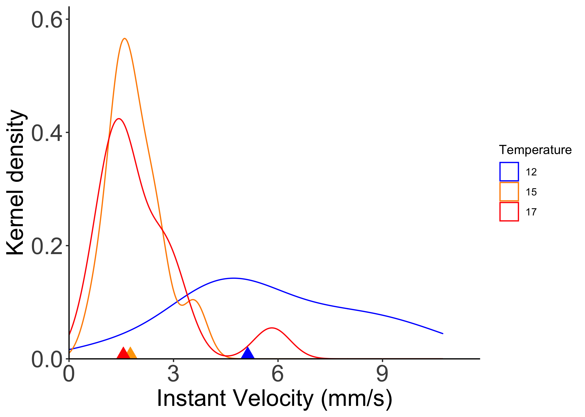<!-- -->

```r
dplot_Time<-ggplot(data1, aes(Tot_Time, color=Temp))+
  geom_density(kernel="gaussian")+
  geom_point(aes(x=20.30, y=0),color="blue",shape=17, size=6)+
  geom_point(aes(x=51.20, y=0),color="orange",shape=17, size=6)+
  geom_point(aes(x=54.35, y=0),color="red",shape=17, size=6)+
  theme_classic()+
  labs(colour="Temperature", x="Total Time Swimming (sec)", y="Kernel density")+ 
  scale_x_continuous(limits = c(0, NA), expand = expansion(mult = c(0, 0.1))) +
  scale_y_continuous(limits = c(0, NA),expand = expansion(mult = c(0, 0.1))) +
  theme(axis.title = element_text(size = 20),axis.text = element_text(size = 20)) +
  scale_color_manual(values =c("blue","darkorange", "red"))
dplot_Time
```

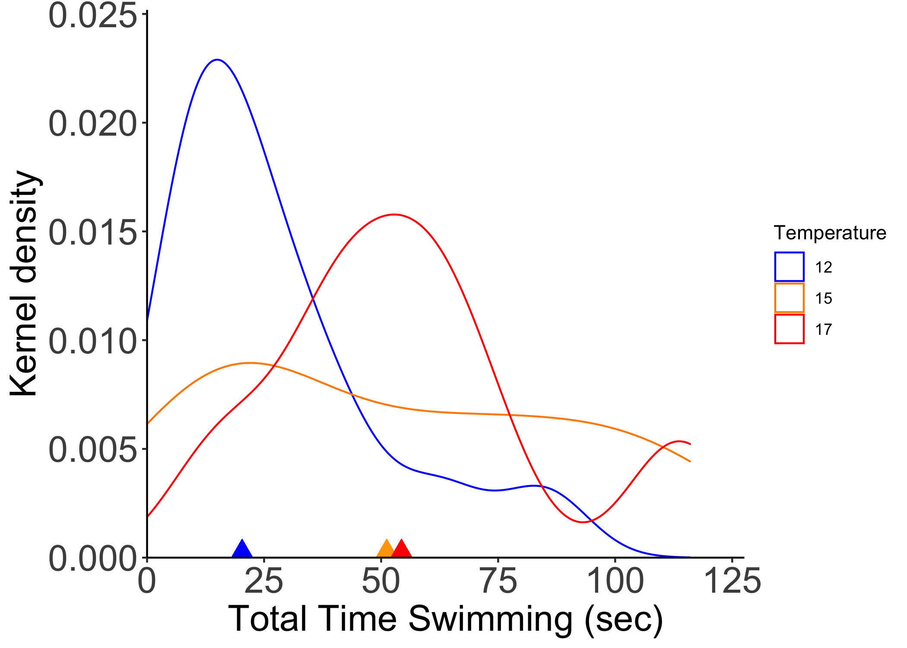<!-- -->

```r
dplot_Max<-ggplot(data1, aes(Max_Time, color=Temp))+
  geom_density(kernel="gaussian")+
  geom_point(aes(x=10.25, y=0),color="blue",shape=17, size=6)+
  geom_point(aes(x=18.80, y=0),color="orange",shape=17, size=6)+
  geom_point(aes(x=19.25, y=0),color="red",shape=17, size=6)+
  theme_classic()+
  labs(colour="Temperature", x="Total Time Swimming (sec)", y="Kernel density")+ 
  scale_x_continuous(limits = c(0, NA), expand = expansion(mult = c(0, 0.1))) +
  scale_y_continuous(limits = c(0, NA),expand = expansion(mult = c(0, 0.1))) +
  theme(axis.title = element_text(size = 20),axis.text = element_text(size = 20)) +
  scale_color_manual(values =c("blue","darkorange", "red"))
dplot_Max
```

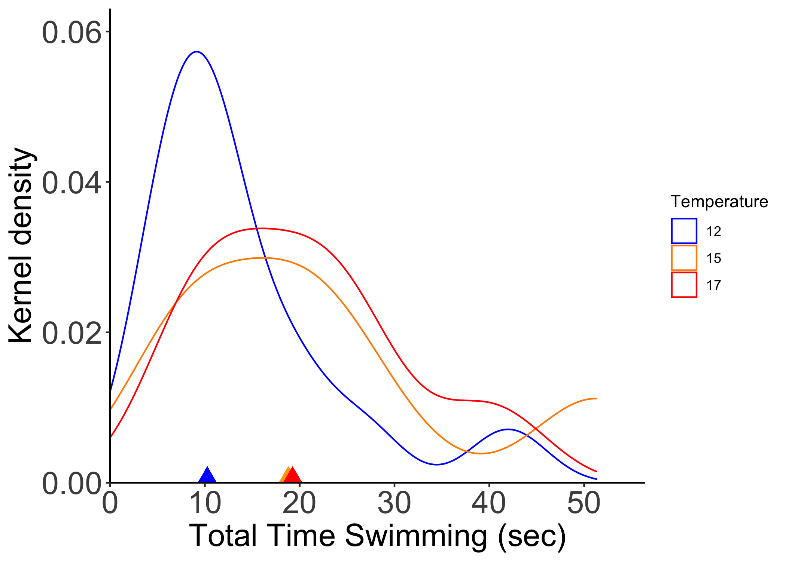<!-- -->


```r
#Checking for normality
shapiro.test(data1$Ist_Vel)
```

```
## 
## 	Shapiro-Wilk normality test
## 
## data:  data1$Ist_Vel
## W = 0.84219, p-value = 7.07e-05
```

```r
hist(data1$Ist_Vel)
```

<!-- -->

```r
shapiro.test(data1$Tot_Time)
```

```
## 
## 	Shapiro-Wilk normality test
## 
## data:  data1$Tot_Time
## W = 0.9082, p-value = 0.003824
```

```r
hist(data1$Tot_Time)
```

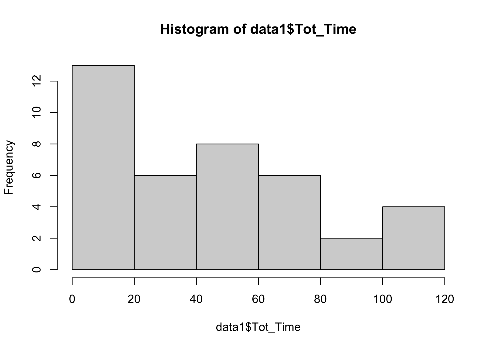<!-- -->

```r
#Checking for heteroscedasticity
leveneTest(data1$Ist_Vel, data1$Temp)
```

```
## Levene's Test for Homogeneity of Variance (center = median)
##       Df F value   Pr(>F)   
## group  2  5.4257 0.008718 **
##       36                    
## ---
## Signif. codes:  0 '***' 0.001 '**' 0.01 '*' 0.05 '.' 0.1 ' ' 1
```

```r
leveneTest(data1$Tot_Time,data1$Temp)
```

```
## Levene's Test for Homogeneity of Variance (center = median)
##       Df F value  Pr(>F)  
## group  2  2.6217 0.08651 .
##       36                  
## ---
## Signif. codes:  0 '***' 0.001 '**' 0.01 '*' 0.05 '.' 0.1 ' ' 1
```


```r
#Linear mixed effects model with Log transformed data. 
#Pote is a factor with random effects and larva is nested in Pote 
modIV<-lmer(log(Ist_Vel)~Temp + (Pote|Larva), data=data1)

#model diagnostic
plot(modIV,which = 1)
```

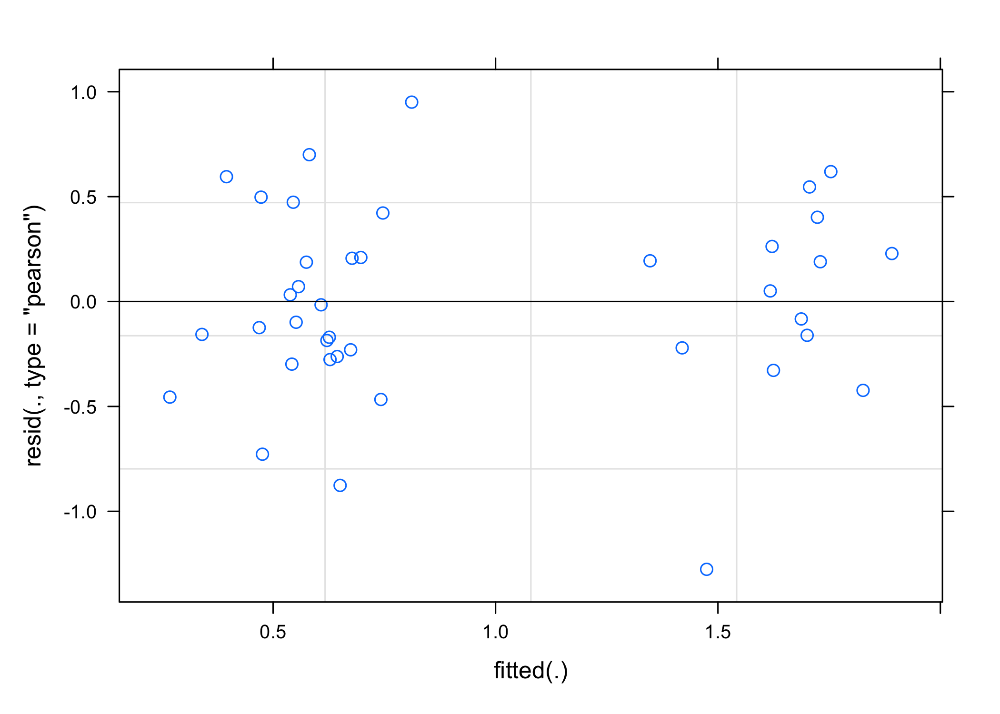<!-- -->

```r
qqnorm(resid(modIV))
qqline(resid(modIV))
```

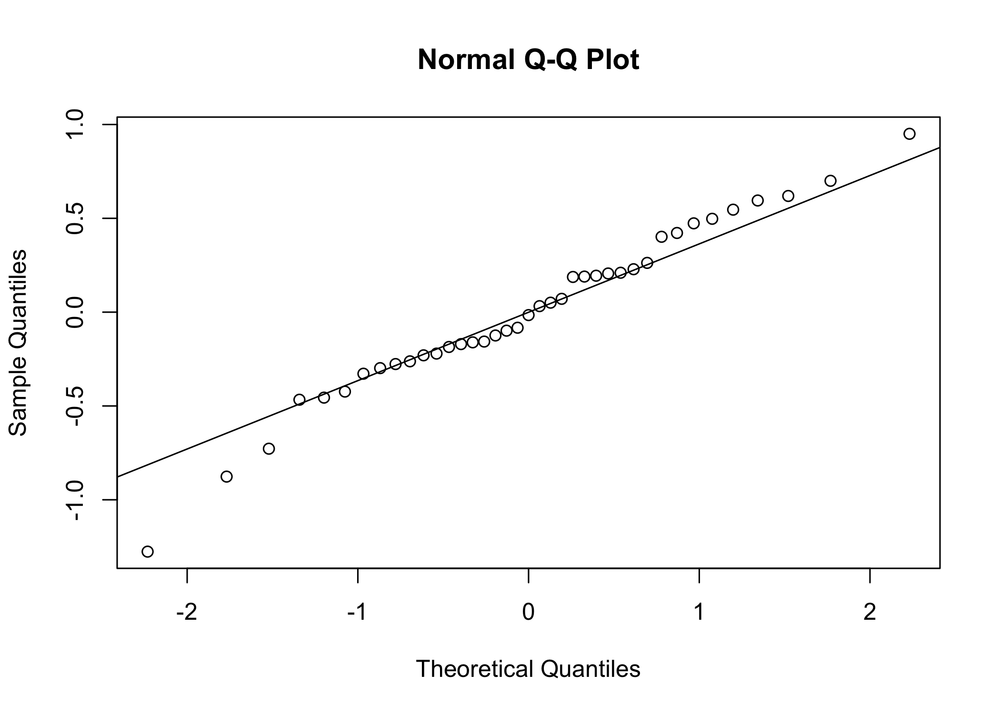<!-- -->

```r
#model output
tab_model(modIV)
```

<table style="border-collapse:collapse; border:none;">
<tr>
<th style="border-top: double; text-align:center; font-style:normal; font-weight:bold; padding:0.2cm;  text-align:left; ">&nbsp;</th>
<th colspan="3" style="border-top: double; text-align:center; font-style:normal; font-weight:bold; padding:0.2cm; ">log(Ist_Vel)</th>
</tr>
<tr>
<td style=" text-align:center; border-bottom:1px solid; font-style:italic; font-weight:normal;  text-align:left; ">Predictors</td>
<td style=" text-align:center; border-bottom:1px solid; font-style:italic; font-weight:normal;  ">Estimates</td>
<td style=" text-align:center; border-bottom:1px solid; font-style:italic; font-weight:normal;  ">CI</td>
<td style=" text-align:center; border-bottom:1px solid; font-style:italic; font-weight:normal;  ">p</td>
</tr>
<tr>
<td style=" padding:0.2cm; text-align:left; vertical-align:top; text-align:left; ">(Intercept)</td>
<td style=" padding:0.2cm; text-align:left; vertical-align:top; text-align:center;  ">1.63</td>
<td style=" padding:0.2cm; text-align:left; vertical-align:top; text-align:center;  ">1.31&nbsp;&ndash;&nbsp;1.95</td>
<td style=" padding:0.2cm; text-align:left; vertical-align:top; text-align:center;  "><strong>&lt;0.001</strong></td>
</tr>
<tr>
<td style=" padding:0.2cm; text-align:left; vertical-align:top; text-align:left; ">Temp [15]</td>
<td style=" padding:0.2cm; text-align:left; vertical-align:top; text-align:center;  ">&#45;1.15</td>
<td style=" padding:0.2cm; text-align:left; vertical-align:top; text-align:center;  ">&#45;1.55&nbsp;&ndash;&nbsp;-0.75</td>
<td style=" padding:0.2cm; text-align:left; vertical-align:top; text-align:center;  "><strong>&lt;0.001</strong></td>
</tr>
<tr>
<td style=" padding:0.2cm; text-align:left; vertical-align:top; text-align:left; ">Temp [17]</td>
<td style=" padding:0.2cm; text-align:left; vertical-align:top; text-align:center;  ">&#45;1.08</td>
<td style=" padding:0.2cm; text-align:left; vertical-align:top; text-align:center;  ">&#45;1.45&nbsp;&ndash;&nbsp;-0.71</td>
<td style=" padding:0.2cm; text-align:left; vertical-align:top; text-align:center;  "><strong>&lt;0.001</strong></td>
</tr>
<tr>
<td colspan="4" style="font-weight:bold; text-align:left; padding-top:.8em;">Random Effects</td>
</tr>

<tr>
<td style=" padding:0.2cm; text-align:left; vertical-align:top; text-align:left; padding-top:0.1cm; padding-bottom:0.1cm;">&sigma;<sup>2</sup></td>
<td style=" padding:0.2cm; text-align:left; vertical-align:top; padding-top:0.1cm; padding-bottom:0.1cm; text-align:left;" colspan="3">0.23</td>
</tr>

<tr>
<td style=" padding:0.2cm; text-align:left; vertical-align:top; text-align:left; padding-top:0.1cm; padding-bottom:0.1cm;">&tau;<sub>00</sub> <sub>Larva</sub></td>
<td style=" padding:0.2cm; text-align:left; vertical-align:top; padding-top:0.1cm; padding-bottom:0.1cm; text-align:left;" colspan="3">0.04</td>

<tr>
<td style=" padding:0.2cm; text-align:left; vertical-align:top; text-align:left; padding-top:0.1cm; padding-bottom:0.1cm;">&tau;<sub>11</sub> <sub>Larva.PoteB</sub></td>
<td style=" padding:0.2cm; text-align:left; vertical-align:top; padding-top:0.1cm; padding-bottom:0.1cm; text-align:left;" colspan="3">0.00</td>

<tr>
<td style=" padding:0.2cm; text-align:left; vertical-align:top; text-align:left; padding-top:0.1cm; padding-bottom:0.1cm;">&tau;<sub>11</sub> <sub>Larva.PoteC</sub></td>
<td style=" padding:0.2cm; text-align:left; vertical-align:top; padding-top:0.1cm; padding-bottom:0.1cm; text-align:left;" colspan="3">0.00</td>

<tr>
<td style=" padding:0.2cm; text-align:left; vertical-align:top; text-align:left; padding-top:0.1cm; padding-bottom:0.1cm;">&rho;<sub>01</sub></td>
<td style=" padding:0.2cm; text-align:left; vertical-align:top; padding-top:0.1cm; padding-bottom:0.1cm; text-align:left;" colspan="3">1.00</td>

<tr>
<td style=" padding:0.2cm; text-align:left; vertical-align:top; text-align:left; padding-top:0.1cm; padding-bottom:0.1cm;"></td>
<td style=" padding:0.2cm; text-align:left; vertical-align:top; padding-top:0.1cm; padding-bottom:0.1cm; text-align:left;" colspan="3">-1.00</td>

<tr>
<td style=" padding:0.2cm; text-align:left; vertical-align:top; text-align:left; padding-top:0.1cm; padding-bottom:0.1cm;">N <sub>Larva</sub></td>
<td style=" padding:0.2cm; text-align:left; vertical-align:top; padding-top:0.1cm; padding-bottom:0.1cm; text-align:left;" colspan="3">5</td>
<tr>
<td style=" padding:0.2cm; text-align:left; vertical-align:top; text-align:left; padding-top:0.1cm; padding-bottom:0.1cm; border-top:1px solid;">Observations</td>
<td style=" padding:0.2cm; text-align:left; vertical-align:top; padding-top:0.1cm; padding-bottom:0.1cm; text-align:left; border-top:1px solid;" colspan="3">39</td>
</tr>
<tr>
<td style=" padding:0.2cm; text-align:left; vertical-align:top; text-align:left; padding-top:0.1cm; padding-bottom:0.1cm;">Marginal R<sup>2</sup> / Conditional R<sup>2</sup></td>
<td style=" padding:0.2cm; text-align:left; vertical-align:top; padding-top:0.1cm; padding-bottom:0.1cm; text-align:left;" colspan="3">0.560 / NA</td>
</tr>

</table>

```r
#model
modTime<-lmer(log(Tot_Time)~Temp + (Pote|Larva), data=data1)
#model diagnostic
plot(modTime,which = 1)
```

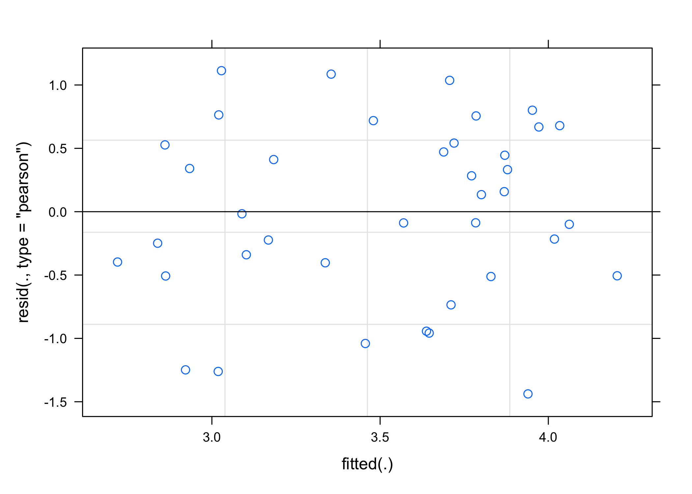<!-- -->

```r
qqnorm(resid(modTime))
qqline(resid(modTime))
```

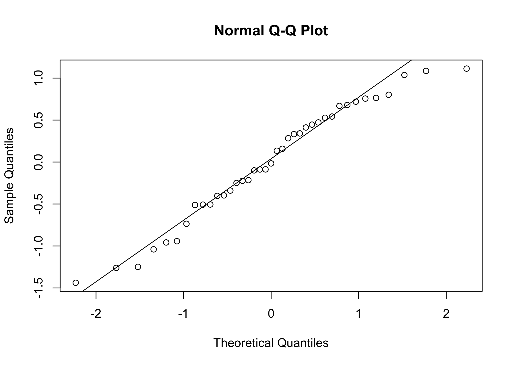<!-- -->

```r
#model output
tab_model(modTime)
```

<table style="border-collapse:collapse; border:none;">
<tr>
<th style="border-top: double; text-align:center; font-style:normal; font-weight:bold; padding:0.2cm;  text-align:left; ">&nbsp;</th>
<th colspan="3" style="border-top: double; text-align:center; font-style:normal; font-weight:bold; padding:0.2cm; ">log(Tot_Time)</th>
</tr>
<tr>
<td style=" text-align:center; border-bottom:1px solid; font-style:italic; font-weight:normal;  text-align:left; ">Predictors</td>
<td style=" text-align:center; border-bottom:1px solid; font-style:italic; font-weight:normal;  ">Estimates</td>
<td style=" text-align:center; border-bottom:1px solid; font-style:italic; font-weight:normal;  ">CI</td>
<td style=" text-align:center; border-bottom:1px solid; font-style:italic; font-weight:normal;  ">p</td>
</tr>
<tr>
<td style=" padding:0.2cm; text-align:left; vertical-align:top; text-align:left; ">(Intercept)</td>
<td style=" padding:0.2cm; text-align:left; vertical-align:top; text-align:center;  ">3.01</td>
<td style=" padding:0.2cm; text-align:left; vertical-align:top; text-align:center;  ">2.55&nbsp;&ndash;&nbsp;3.47</td>
<td style=" padding:0.2cm; text-align:left; vertical-align:top; text-align:center;  "><strong>&lt;0.001</strong></td>
</tr>
<tr>
<td style=" padding:0.2cm; text-align:left; vertical-align:top; text-align:left; ">Temp [15]</td>
<td style=" padding:0.2cm; text-align:left; vertical-align:top; text-align:center;  ">0.62</td>
<td style=" padding:0.2cm; text-align:left; vertical-align:top; text-align:center;  ">0.01&nbsp;&ndash;&nbsp;1.23</td>
<td style=" padding:0.2cm; text-align:left; vertical-align:top; text-align:center;  "><strong>0.048</strong></td>
</tr>
<tr>
<td style=" padding:0.2cm; text-align:left; vertical-align:top; text-align:left; ">Temp [17]</td>
<td style=" padding:0.2cm; text-align:left; vertical-align:top; text-align:center;  ">0.85</td>
<td style=" padding:0.2cm; text-align:left; vertical-align:top; text-align:center;  ">0.28&nbsp;&ndash;&nbsp;1.42</td>
<td style=" padding:0.2cm; text-align:left; vertical-align:top; text-align:center;  "><strong>0.005</strong></td>
</tr>
<tr>
<td colspan="4" style="font-weight:bold; text-align:left; padding-top:.8em;">Random Effects</td>
</tr>

<tr>
<td style=" padding:0.2cm; text-align:left; vertical-align:top; text-align:left; padding-top:0.1cm; padding-bottom:0.1cm;">&sigma;<sup>2</sup></td>
<td style=" padding:0.2cm; text-align:left; vertical-align:top; padding-top:0.1cm; padding-bottom:0.1cm; text-align:left;" colspan="3">0.54</td>
</tr>

<tr>
<td style=" padding:0.2cm; text-align:left; vertical-align:top; text-align:left; padding-top:0.1cm; padding-bottom:0.1cm;">&tau;<sub>00</sub> <sub>Larva</sub></td>
<td style=" padding:0.2cm; text-align:left; vertical-align:top; padding-top:0.1cm; padding-bottom:0.1cm; text-align:left;" colspan="3">0.12</td>

<tr>
<td style=" padding:0.2cm; text-align:left; vertical-align:top; text-align:left; padding-top:0.1cm; padding-bottom:0.1cm;">&tau;<sub>11</sub> <sub>Larva.PoteB</sub></td>
<td style=" padding:0.2cm; text-align:left; vertical-align:top; padding-top:0.1cm; padding-bottom:0.1cm; text-align:left;" colspan="3">0.03</td>

<tr>
<td style=" padding:0.2cm; text-align:left; vertical-align:top; text-align:left; padding-top:0.1cm; padding-bottom:0.1cm;">&tau;<sub>11</sub> <sub>Larva.PoteC</sub></td>
<td style=" padding:0.2cm; text-align:left; vertical-align:top; padding-top:0.1cm; padding-bottom:0.1cm; text-align:left;" colspan="3">0.02</td>

<tr>
<td style=" padding:0.2cm; text-align:left; vertical-align:top; text-align:left; padding-top:0.1cm; padding-bottom:0.1cm;">&rho;<sub>01</sub></td>
<td style=" padding:0.2cm; text-align:left; vertical-align:top; padding-top:0.1cm; padding-bottom:0.1cm; text-align:left;" colspan="3">-1.00</td>

<tr>
<td style=" padding:0.2cm; text-align:left; vertical-align:top; text-align:left; padding-top:0.1cm; padding-bottom:0.1cm;"></td>
<td style=" padding:0.2cm; text-align:left; vertical-align:top; padding-top:0.1cm; padding-bottom:0.1cm; text-align:left;" colspan="3">-1.00</td>

<tr>
<td style=" padding:0.2cm; text-align:left; vertical-align:top; text-align:left; padding-top:0.1cm; padding-bottom:0.1cm;">N <sub>Larva</sub></td>
<td style=" padding:0.2cm; text-align:left; vertical-align:top; padding-top:0.1cm; padding-bottom:0.1cm; text-align:left;" colspan="3">5</td>
<tr>
<td style=" padding:0.2cm; text-align:left; vertical-align:top; text-align:left; padding-top:0.1cm; padding-bottom:0.1cm; border-top:1px solid;">Observations</td>
<td style=" padding:0.2cm; text-align:left; vertical-align:top; padding-top:0.1cm; padding-bottom:0.1cm; text-align:left; border-top:1px solid;" colspan="3">39</td>
</tr>
<tr>
<td style=" padding:0.2cm; text-align:left; vertical-align:top; text-align:left; padding-top:0.1cm; padding-bottom:0.1cm;">Marginal R<sup>2</sup> / Conditional R<sup>2</sup></td>
<td style=" padding:0.2cm; text-align:left; vertical-align:top; padding-top:0.1cm; padding-bottom:0.1cm; text-align:left;" colspan="3">0.208 / NA</td>
</tr>

</table>


```r
#pairwise comparison using estimated means
meansIV<-emmeans(modIV, pairwise ~ Temp, adjust="bonferroni")
meansTime<-emmeans(modTime, pairwise ~ Temp, adjust="bonferroni")

#Plotting as boxplots with log transformed data
cld<-cld(meansIV$emmeans,Letters =letters)
data1 <- data1 %>% group_by(Temp) %>%   mutate(cld = case_when(Temp == 12 ~ "b",
                       Temp ==  15 ~ "a",
                       Temp == 17 ~ "a"))

p1<-ggplot(data1, aes(x=Temp, y=log(Ist_Vel), fill=Temp))+geom_boxplot()+
  stat_summary(fun.y =mean,geom="point",width=0.75,
  size=1,linetype="solid") +
  geom_jitter(color="black", size=0.6, alpha=0.3)+
  theme_classic()+labs(x="Temperature", y="IV")+theme(legend.position="none")+
   scale_fill_manual(values =c("blue","darkorange", "red"))+ 
  scale_y_continuous(breaks =c(1,2,0))+ geom_text(x=1.2,y=2.3,label="a",color="red")+
  geom_text(x=1.2,y=2.3,label="a",color="red")+
  geom_text(x=2.2,y=1.3,label="b",color="red")+
  geom_text(x=3.2,y=1.3,label="b",color="red")
p1
```

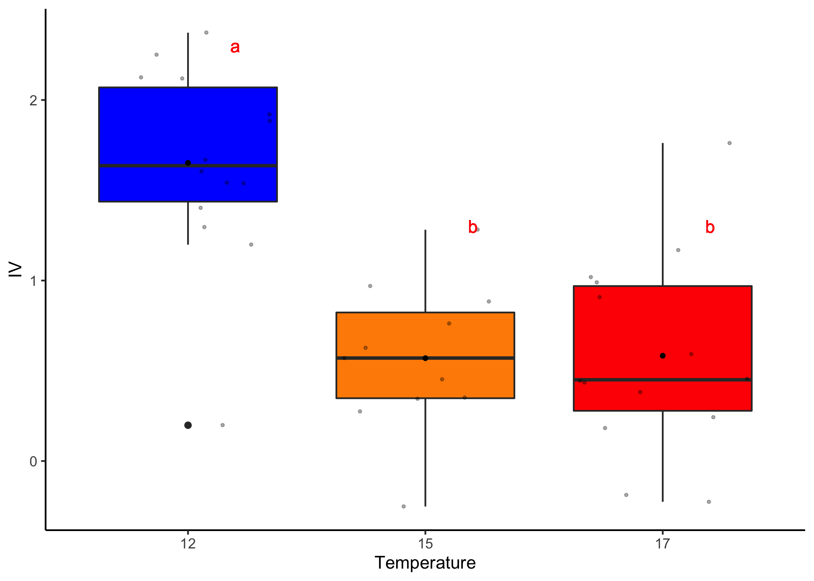<!-- -->

```r
p2<-ggplot(data1, aes(x=Temp, y=log(Tot_Time), fill=Temp))+
  geom_boxplot()+ stat_summary(fun.y =mean,geom="point",width=0.75,
  size=1,linetype="solid") + 
  geom_jitter(color="black", size=0.6, alpha=0.3)+
  theme_classic() + theme(legend.position="none") +
  labs(x="Temperature", y="TT")+
   scale_fill_manual(values =c("blue","darkorange", "red"))+
  geom_text(x=1.2,y=4.7,label="a",color="red")+
  geom_text(x=2.2,y=4.7,label="ab",color="red")+
  geom_text(x=3.2,y=4.7,label="b",color="red")
p2
```

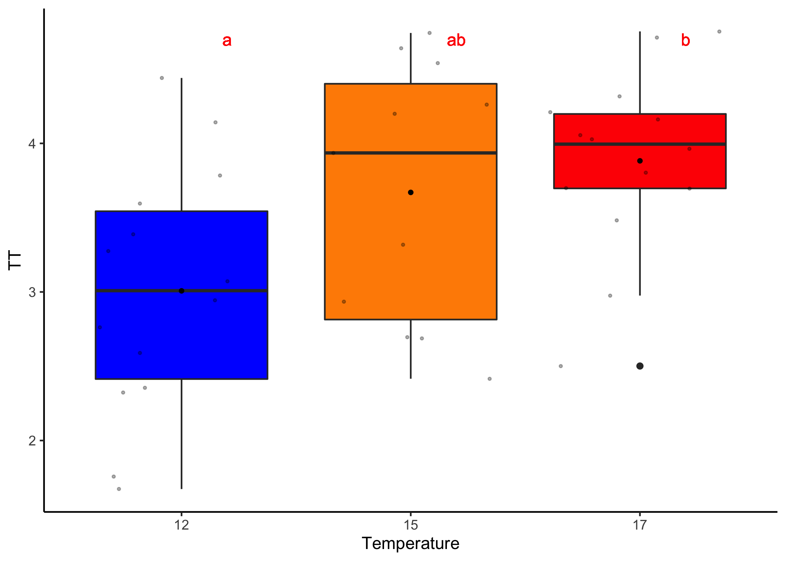<!-- -->


```r
#plotting final kernel graphs with insets
plot.with.inset.IV <-
  ggdraw() +
  draw_plot(dplot_IV) +
  draw_plot(p1, x = .49, y = 0.65, width = .3, height = .35)
plot.with.inset.IV
```

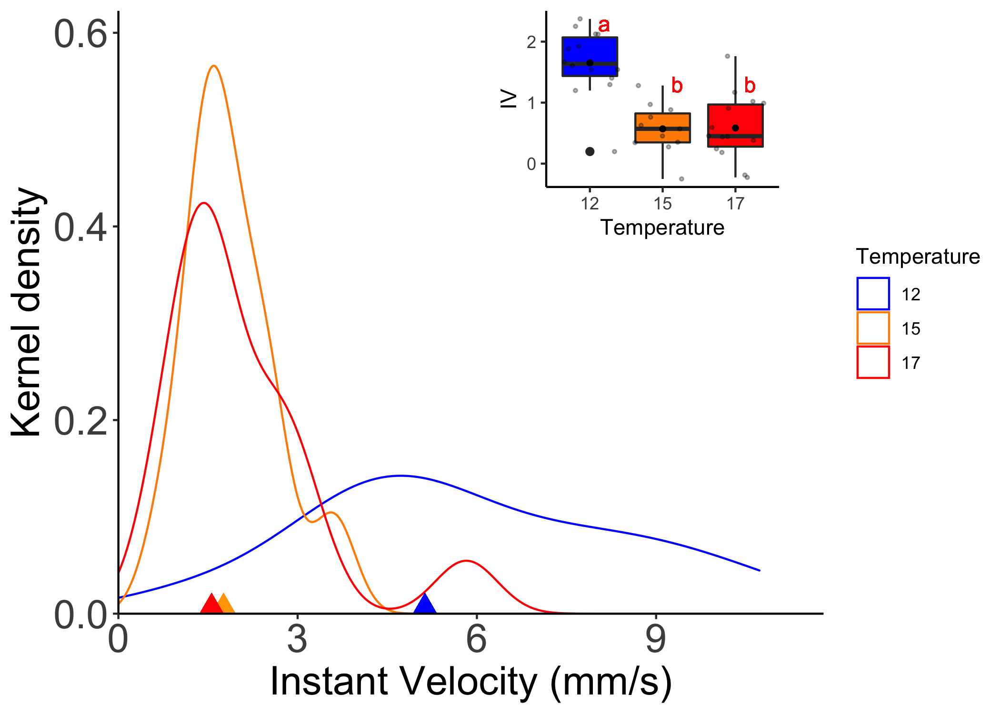<!-- -->

```r
plot.with.inset.Tot_Time <-
  ggdraw() +
  draw_plot(dplot_Time) +
  draw_plot(p2, x = .49, y = 0.65, width = .3, height = .35)
plot.with.inset.Tot_Time
```

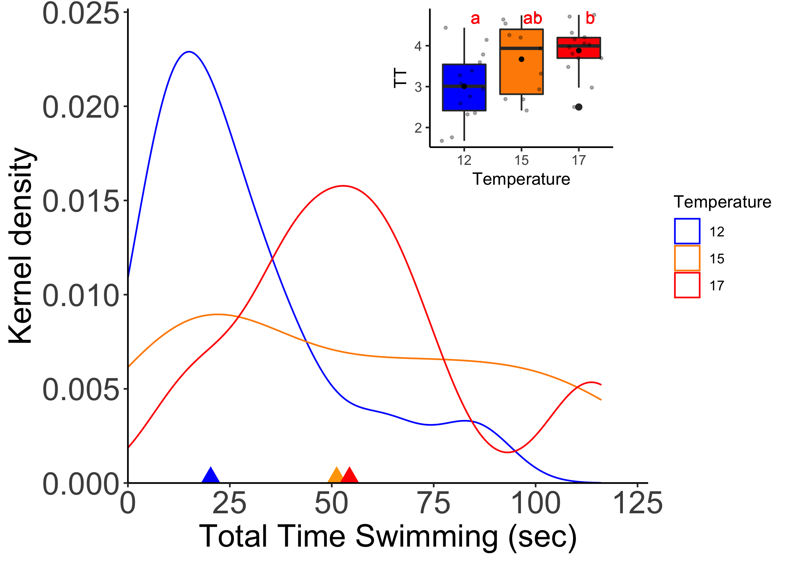<!-- -->
